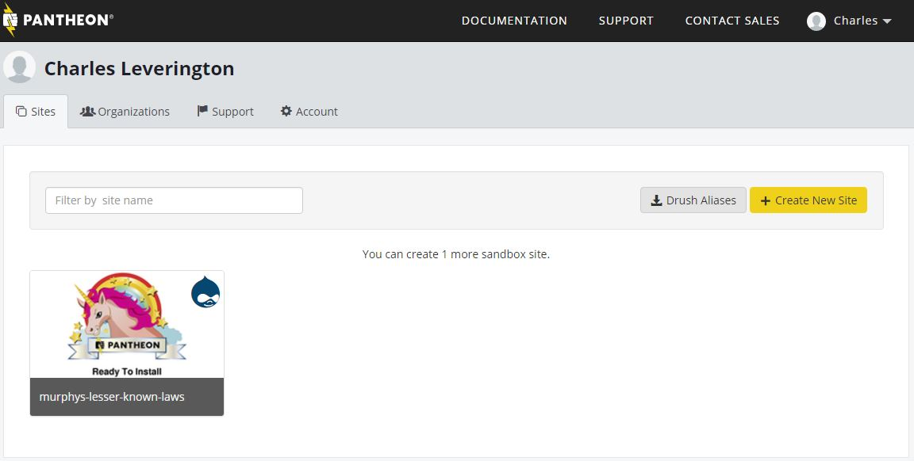
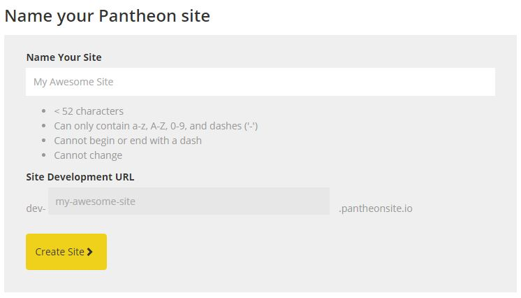
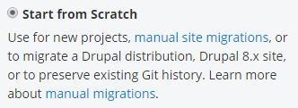
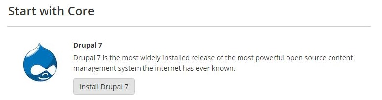
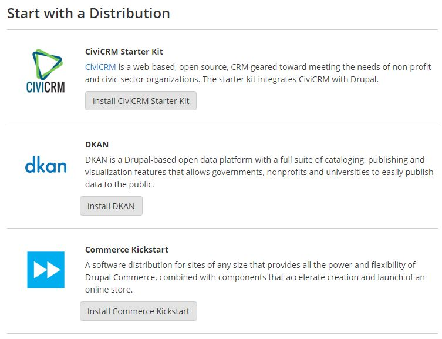
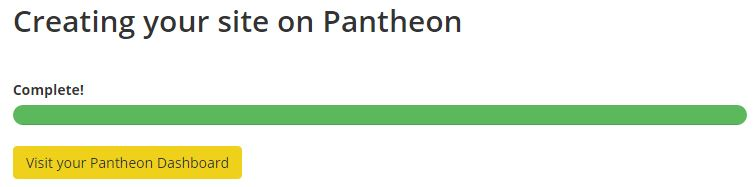

# Creating Your First Site

## Step 1 - Creating A Site

### Navigate to Pantheon.io Dashboard

### Click **+ Create New Site**

### Name Your Drupal Site

This site name will be registered under multiple places (unless you've chosen a paid plan, where options become available):

* dev-yoursite.pantheon.io
* test-yoursite.pantheon.io
* yoursite.pantheon.io

Enter the name of your chosen site and click *Create Site*.

> **Reminder** - For the rest of this course, "*your*" site will be referred to as "*https://mysite.pantheon.io*".

> This means that if your site is "*johnsportfolio.pantheon.io*", then instructions for accessing the Administration Menu via *https://mysite.pantheon.io/admin* should instead be read as *johnsportfolio.pantheon.io/admin*.

That's correct. If you are willing to keep your site under a Pantheon.io URL, you can actually use the Live site for showcase purposes.

> **Warning** - Once you pass this step, don't stop until your site is fully created or you will have to wait a few minutes, refresh, delete the newly *uncreated* site, and start again.

### Configure Your Site
From the Site Configuration page, select *Start from Scratch* as we will be creating a fresh Drupal 7 installation for this site.

For your Portfolio Project, select the *Drupal 7* clean instance and Click *Install Drupal 7*:

Savvy users will notice that Pantheon allows for many options beyond the Cookie Cutter Wordpress, Drupal 7, or Drupal 8. See the Further Reading for links to the different options for site creation, such as [CiviCRM](https://civicrm.org/ "CiviCRM"), [Commerce Kickstart](https://drupalcommerce.org/commerce-kickstart-2 "Commerce Kickstart"), and [Open Atrium](http://www.openatrium.com/#!/ "Open Atrium"). These are called **Distributions** and are one of the options for installing Drupal.

**Distributions** are pre-configured Drupal "distributions" with customized modules, pre-installed contrib modules, and (often) pre-configured themes for quickly going online with a specific site-instance. The Commerce Kickstart toolkit, for example, is pre-configured to quickly get Web Authors/Developers online and live with PayPal accessible sites (and beyond, if users already have contracts with necessary companies).

Just like all things within Drupal, even the **Distributions** are **Modular**. [Panopoly](http://drupal.org/project/panopoly "Panopoly"), for example, is a popular distribution for *creating* distributions because it allows for efficient container/node/content-type scaffolding with much less custom PHP on the part of the Site Builder. [Open Academy](https://drupal.org/project/openacademy "Open Academy"), [Open Atrium](http://www.openatrium.com/#!/ "Open Atrium"), [Open Church](https://drupal.org/project/openchurch "Open Church"), [Open Restaurant](https://drupal.org/project/restaurant "Open Restaurant"), and the [Web Experience Toolkit](https://drupal.org/project/wetkit "Web Experience Toolkit") (and more!) all use [Panopoly](http://drupal.org/project/panopoly "Panopoly") as the "base distribution" for *their* distribution.

#### Pantheon Does the Legwork!
Part of the reason for using Pantheon.io, the Acquia Dev-Desktop, Kalabox, and other turn-key solutions is the fact that *they do all the work* of installation and configuration. This allows Web Authors/Developers to focus on the important parts of web creation: Your Content!

### When the site finishes loading, Click *Visit your Pantheon Dashboard*

### Congratulations!

You have successfully *created* Your First Site!

Next, we need to *install* Your First Site!
