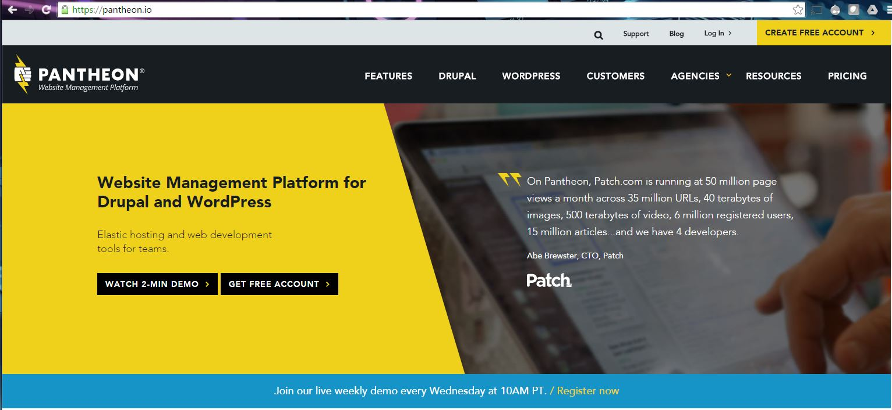
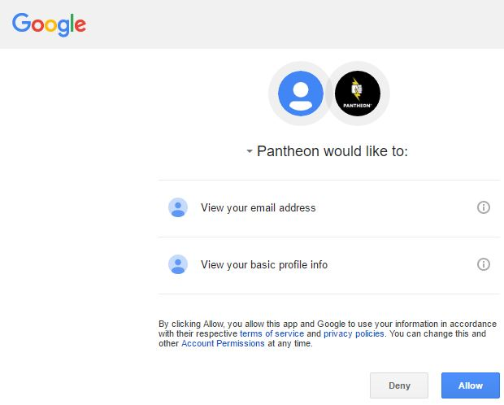
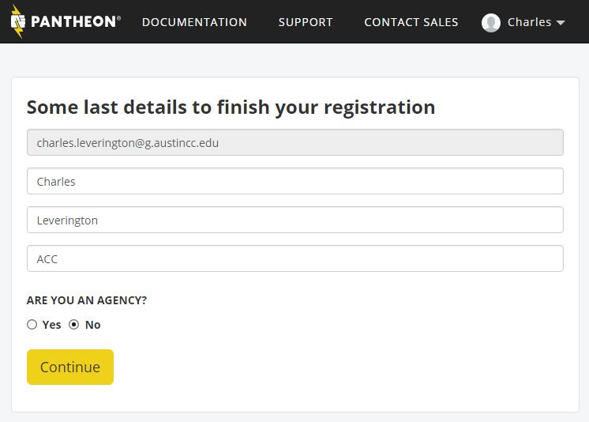

# Creating a [Pantheon.io](https://pantheon.io "Pantheon.io") Account

## Prerequisites

* Git Bash or Git For Windows must be installed.
* An email address for account verification.
* SSH Key creation.
 * See [Section 1.1.2: Creating a GitHub Account](manuscript/creating-github-account.md "Section 1.1.2: Creating a GitHub Account")

## Goals

* Create an account at *Pantheon.io*
* Verify created account via email
* Upload local SSH Key to Pantheon.io remote repository

## Creating a [Pantheon.io](https://pantheon.io "Pantheon.io") Account

#### Open any modern web-browser.

#### Navigate to [Pantheon.io](https://pantheon.io "Pantheon.io")

#### Click the yellow *CREATE FREE ACCOUNT* button at the top-right of the screen.

#### Click Connect with Google

> For those Students with Google accounts, it is often best to simply click the *Connect with Google* button.

##### Allow Pantheon to Connect with Google

##### Create your free account (Without Google)

> For those Students without Google accounts, standard account creation is still acceptable.

#### Complete Account Creation

## Beyond [Pantheon.io](https://pantheon.io "Pantheon.io")

Placeholder

## Further Reading
 * [Drupal Association](https://assoc.drupal.org "Drupal Association") - Known as the DA, the Drupal Association roots the heart and soul of the Drupal Community by fostering and supporting Drupal projects, marketing Drupal to new users, supporting Drupal infrastructure through events like DrupalCons & DrupalCamps, and a lot more!
 * [Get Started with Drupal](https://www.drupal.org/start "Get Started with Drupal")  - Here you'll find quick-links to all of the most popular extensions, documentation, and support resources for new Drupal users.
