Modern Drupal 7 Web Authoring

Foreword and Introduction

By: Charles Leverington & Fito Khan

**Modern Drupal 7 Web Authoring - Foreword and Introduction**

Published by Charles Richard Leverington & Adolf "Fito" Kahn © 2016 (Pending)

Your feedback is welcome and we are always open to suggestions for updating our Curriculum. Please do not hesitate to tell us about your experience using the form included within the Appendix or handed out by your Instructors in the middle and at the end of the course.

# Foreword

| * "If it isn't documented, it doesn't exist."*

If there is nothing else this book may teach you, the reader, it is that documentation and a well-implemented version control system (VCS) are the two single-most vital pieces of any digital system. Computer, web, database, mainframe, legacy, it does not matter what the system is, or what the system is used for. As long as a solid VCS is in place (and instructions on how to use it while making it better), the system will continually improve because you, the user, can (and should) take the time to improve it.

Drupal is a fantastic Web 3.0 enabled platform that provide us with a highly RESTful API.

For those unsure of what REST might be, it is actually a fairly *simple* concept that tends to be horribly complicated when trying to read it out of a book. Because of its importance to this class however, I will provide a short definition here.

*Simplified* **REST** - Also known as **RE**presentational **S**tate **T**ransfer says that all networks, all databases, everything, should connect through *simple* methods, such as HTTP.

HTTP, as everyone knows, stands for **H**yper-**t**ext **T**ransfer **P**rotocol.

This means the **Internet**. The entire World Wide Web (WWW) is a giant network built using REST-based architecture.

We will get into more detail later, but the reason we have come as far as we have today is because **it was documented**, which means **it exists**. With each version, each release, each edit, and each person contributing to the world, the Internet got better and better until a man named Dries Buytaert created a dynamic forum platform that he called Drupal.

Welcome to your journey into Web Authoring with Drupal, a platform and community used by millions of people and tens of thousands of businesses the world over.

Note

This book is was written with a focused commitment on **Novice Level** Drupal. In Car Salesman terms, this would be a "Bumper to Bumper" book, but I prefer the Super Hero mentality: "From Zero to Hero".

[[TOC]]

# About The Book

## Prerequisites:

* Familiarity with computers and browsing the Internet, Intermediate WWW Authoring, HTML, and CSS.

## Objectives:

### **Every student will be able to:**

* Describe multiple industry recommended methods for server file-transfers

* List the seven architectural properties affected by the constraints defined within the REST architectural style and

* Create web pages and supporting elements using current authoring tools

* Maintain web pages and supporting elements

* Troubleshoot common CMS issues within Drupal and similar CMS systems

* Describe PHP and its relation to the Drupal web system

* Identify and explain the parts the LAMP (Linux, Apache, MySQL, and PHP) Stack and the Drupal Stack

* Use Pantheon.io, one of the foremost Drupal Open SaaS hosting platforms, to quickly and easily create, deploy, update, and manage modern websites

* Create and use Cascading Style Sheets, HTML5 enhanced templates, and JavaScript frameworks (such as Foundation 6) within the Drupal web system

* List common Developer Tools for maintaining accessibility requirements, cross-browser compatibility, and RESTful enabled services

* Publish a customized portfolio website utilizing modern JavaScript frameworks, HTML5, and CSS3 functionality on a Drupal-enabled platform

* * *

## Further Reading:

# About The Authors

## Charles Leverington

Howdy.

As a Texan, I am told (often) I pretty much have to start with Howdy. Also, no, we do not check our horses at the border.

My name, as you might have guessed, is Charles Leverington (aka: Pedran or cleverington).

I am a near-Fanatical Drupalist, (Self-Declared) Philosopher, Web Efficiency Designer, Aspiring Author, Think-tank, and Quality Specialist. I have worked for over a decade in both Quality Assurance and Online Development. I also has experience with design and customer module development in Drupal 6, Drupal 7, Drupal Gardens, and (soon) Drupal 8. To date, I have been a Contributor or Developer for three published websites and one Full-Stack Drupal design and deployment for a project-wide Intranet.

I have written various fiction short stories, novellas, and even a couple of novels over the last decade and published a few in-progress fan fiction works on FanFiction.net (aka: [Pedran](https://www.fanfiction.net/u/164598/Pedran) ).

Concerning Web Development and Drupal, I am currently writing a companion book entitled *"A n00b's Guide to Drupal, Development, & Everything"*, which will remain as a free ebook forever under the Creative Commons License. In addition, I have extensive experience teaching Drupal Administration, Web Authoring, local development methodologies, and, most recently, have given lectures on the importance of Design Systems, Accessibility, and Modularity in the modern web.

### Look me up

"No man is an island." ~ John Donne (1624)

Thoughts, recommendations, good recipes for cooking pumpkin: *[Twitter | @c_leveringto*n](https://twitter.com/c_leverington)* *[github | cleverington](https://github.com/cleverington/n00b-drupal-development) * [d.o | cleverington](https://www.drupal.org/u/cleverington)

## Fito Kahn

Drupal Trainer - NxtTeam, Inc. - Senior Partner - Multimedia Partners, Web Developer (Drupal,Wordpress),Web Design and SEO organization. Musician, Recording Engineer (ISMS Records), Director - Austin Jazz Alliance, Texas Jazz Jam Cruise.

Drummer with Night Revival. Drummer with Freedom. Drummer/Percussionist with Caliban. Drummer with Groove Daddy. Percussionist with Duane Carter Band Gear LP Classic II series Congas LP Classic II series bongos SRW 50 Bass Amp

### Connect

 *[Twitter | @arkii*i](https://twitter.com/arkiii)* *[github | arkiii](https://github.com/arkiii) *[d.o | arkii*i](https://www.drupal.org/u/cleverington)* *[g+ | FitoKahn](https://plus.google.com/+FitoKahn/posts) * [All About Jazz | Fito Kahn](http://musicians.allaboutjazz.com/fitokahn)

# Syllabus

AUSTIN COMMUNITY COLLEGE

CONTINUING EDUCATION

Web Authoring: Drupal

(64 hours)

ITSE 2013

## COURSE SYLLABUS

### Course Description

Instruction in designing and developing web pages that incorporate text, graphics, and other supporting elements using current technologies and authoring tools. Use Drupal-based web systems to dynamically store and generate web sites.

### Prerequisites

Familiarity with computers, browsing the Internet, and Intermediate WWW Authoring, HTML, and CSS.

### Objectives

Every student will be able to: *Create web pages and supporting elements using current authoring tools *Maintain web pages and supporting elements *Articulate Drupal terminology *Describe Drupal’s layer structure *Manage, display, and create relational content structures *Manage the display of content *Implement roles, permissions, workflows, and navigations *Properly use taxonomy *Create, install, and configure modules *Effectively work with Drupal’s theme layer *Use Drupal theme files, pre-process functions, and sub-themes *Use layout building modules (panels, context, display suite) * Utilize industry software tools for creating, editing, and debugging

### Rationale

In the past few years, Drupal has grown to become one of the more popular open source Content Management Systems. From large corporations to universities, organizations are choosing Drupal as their web development platform and enterprise solution. It has widespread adoption because it is written in PHP, is extensible, secure, and counts on an ever growing number of developers that continue to work on improving the software. It is currently used by a variety of popular web sites including higher educational institutions such as University of Texas, Kent State, Ohio State, Harvard, Oxford, Duke and Brown, corporations such as weather.com, Twitter, The Economist, The Grammys, LadyGaga.com, and even the White House.

### Required Material

None

### Type of Course

Short Course

### Evaluation

Students will be evaluated on their competency in performing a variety of hands-on exercises created to insure the student has achieved all course objectives throughout the course, and class participation. In order to grant CEU credit for a course the students must be able to complete assessment exercises for each part of the course given by the instructor. The instructor will validate each participant’s achievement of the course objectives by signing and awarding individual certificates of completion.

### Course Outline

1. Preparing Your Development Environment (12 Hours)

    1. Content Management Systems (CMS)

    2. Drupal

    3. Version Control

    4. An Introduction to Drush and the Command Line Interface (CLI)

    5. BitBucket

    6. Remote Environment

    7. Local Environment

    8. Drupal Installation

    9. Development Tools (Atom.io, PHPStorm, Google Chrome, Git Bash)

2. Drupal Site Building (12 hours)

    10. Content Management Systems

    11. Drupal - Core Basics

    12. Design System - Accessibility, Mobile-First Design, Modularity

    13. The Drupal Stack and the LAMP Stack

    14. Basic Site Configuration

        1. Administrative Overview

        2. Roles, Permissions, Users

        3. Blocks

        4. Views

3. Drupal Layout & Themes (12 hours)

    15. Design Systems - Pattern Labs & 'Mini Bootstraps'

    16. Responsive Web Design

    17. The Drupal Theme Engine

    18. Overriding Themes

    19. Understanding Style Sheets, CSS

4. Panels, Display Suite, context (10 hours)

    20. Introduction to Panels

    21. Creating Drupal Sites with Panels

    22. Panel Variants, Views Displays

    23. Panels for Forms

    24. Understanding the Panalizer & Display Suite Modules

5. Modules (6 hours)

    25. Drupal Framework

    26. Contribution Modules

    27. Creating Modules

    28. Distribution

6. Troubleshooting (9 hours)

    29. Security Considerations

    30. Drupal Caching Tools

    31. WSOD - The "White Screen of Death" Errors

7. The Future (3 hours)

    32. Drupal - next version

    33. TWIG

    34. Design System Done The Drupal Way

# Prerequisites

## Prerequisite Knowledge

All aspiring developers should have: *a familiarity with computers and browsing the Internet; *Intermediate WWW Authoring knowledge and experience; and, * basic HTML and CSS styling & theming knowledge.

Knowledge of command line tools, such as iTerm2 (Mac OS) or the Command Prompt (Windows) is preferred, but in no way required.

The most vital prerequisite for the course is a willingness to learn new, exciting, and engaging technologies used throughout the world today.

Despite mostly being open source projects, the tools used within this class are applicable across many industries. Many considered the widespread adoption of Open Source software a scenario of "in spite of" being Open Source for a very long time. Unfortunately for those proprietary companies, software such as the Text-Editor [atom.io](https://atom.io/) and [Drupal](https://www.drupal.org/) itself are gaining notoriety and more universal adoption **because**they are open source. These projects have Communities numbering in the thousands (or hundreds of thousands) tweaking, improving, and perfecting the software.

As stated, the tools, methodologies (methods), design approach, and application structures learned within this class can be taken far, far beyond Drupal.

## Software

Your classroom computers should already have the required software installed.

Here is the software we will be using in this course: **_A Full Featured Text-Editor:_*** * Atom.io* **A Full Featured Integrated Development Environment (IDE)** * PHPStorm (Free for one yrs registration per User with a .edu email addy) **_A Git Client_*** * Git Bash / Git for Windows* **Drupal Web Hosting Service** * [Pantheon.io](https://pantheon.io/) **_Git Hosting Service_*** * **[BitBucket.or*g](https://bitbucket.org/)* (Hosted Service [unlimited free repos for accounts registered with .edu emails]) ***Drupal Development's Local Server Toolkit** * [Acquia's](https://www.acquia.com/) [Acquia Dev Desktop](https://www.acquia.com/downloads) * [Moshe Weitzman's](https://www.drupal.org/u/moshe-weitzman) [Drush](https://github.com/drush-ops/drush) (Built in)

In the next few sections, we will walk slowly through creating an account and logging in with BitBucket, Pantheon, and Drupal.org, followed by configuring Acquia Dev Desktop with a Pantheon.io Drupal 7 instance for local development.

## Challenges

Every Challenge exercise will include careful walkthroughs with screenshots and Instructor-led development.

It is important to remember as the course progresses that early development in any platform, system, software language, or CMS often results in errors, which is **OKAY**.

A full Section is dedicated to Troubleshooting [Drupal](https://www.drupal.org/) within the Course. Students are welcome to try Troubleshooting their own issues or contacting their Instructor.

# System Requirements

## The System

A local stack capable of running Drupal or WordPress.

Kalabox integrates with the Pantheon platform. Tools such as Acquia Dev Desktop, Drupal VM, Vlad, MAMP, WAMP, XAMPP, and even Docker for Windows all work.

As it is the most **stable** software during the creation of this curriculum, we will be using the [Acquia Dev Desktop](https://www.acquia.com/products-services/dev-desktop) for Development within this course.

Pantheon uses a particular architecture to maximize performance and availability, but it's possible to run the same code on a variety of different configurations. As long as the solution supports a minimum of PHP 5.3 and MySQL, you should be fine.

### Items Included Within [Acquia Dev Desktop](https://www.acquia.com/products-services/dev-desktop) (from Acquia.com)

* **Dev Desktop App:** The heart of Dev Desktop, the app lets you manage your local or cloud-based sites, including Drupal multisite, and optionally synchronize them with Acquia Cloud. App updates are checked automatically.

* **Apache web server:** The world's most popular web server

* **Percona MySQL database server:** The world's most popular database server

* **PHP:** Multiple versions of the programming language that powers Drupal

* **phpMyAdmin:** A popular MySQL management and query tool

* **XMail Server (Windows only):** An email server that allows your site to send email directly (Mac OS X has this functionality built in)

* **2** Git client for tracking code changes

* We will be using [Git for Windows](https://git-scm.com/download/win), which is available from the [Software Freedom Conservancy](https://git-scm.com/sfc).

* **3** SFTP client, such as FileZilla, for transferring files OR rsync

* **4** Terminus

* **5** Drush (optional)

**Note** - The Terminal within the Acquia Dev Desktop has limited functionality which mimics popular Command Line (CLI) tools found in Mac and Linux systems, but is is *not* a clone of the Linux Kernel-based Terminal.

#### Additional Resources

* https://pantheon.io/docs/application-containers/

# Foreword

* **Week One: Overview & Development**

    * Foreword

        * Section One: Introduction

        * Section Two: Early Development

        * Section Three: Joining *Drupal.org*

        * Section Four: Creating a BitBucket Account

        * Section Five: *Pantheon.io* Account

        * Section Six: Drupal Overview

        * Section Seven: System Requirements

        * Section Eight: The Workflow

    * Unit One: Preparing Your Development Environment

        * Section One: Content Management Systems

        * Section Two: Drupal - An Introduction

        * Creating Your First Site

        * Adding a Git Workflow to Your Site

        * Creating Your Local Server

* **Week Two: Local Development and Drupal Site Building**

        * Extending Drupal

        * Installing Modules - CTools

        * Installing Modules - Administrative Menu

        * Unit One: Summary

        * Unit One: Further Reading (*Aggregated from all Sections*)

    * Unit Two: Drupal Site Building 

        * Static vs. Dynamic

        * The Drupal Stack

        * Drupal Core Basics

        * User Roles & Permissions

        * Content Types

        * Taxonomy

        * Structured Content

* **Week Three: Views, Menus, & Content Manipulation**

        * Views

        * Site Navigation & URLs

        * URL Aliases

        * The Menu System

        * Module Configuration & Extending Drupal

        * Creating an Event Calendar

        * Custom Error Messages

        * Custom Content Editing Boxes

* **Week Four: Drupal Layout & Contrib Themes**

    * Unit Three: Design Systems, Drupal Layout & Drupal Themes

        * Web Theming Fundamentals & Design Systems 

        * Drupal Theming Fundamentals

        * Customizing Themes

        * Anatomy of a Theme

        * Coding Drupal

        * The Drupal Theme Engine

        * Template Files - Overriding Theme Pieces

        * Add Regions to Themes

        * Base Themes, Starter Themes, Distribution Themes

        * Subtheming

            * Subtheme Inheritance

        * Keep it Zen - The Starter Subtheme

        * Markup & Mini Panels

* **Week Five: CSS in Drupal, Responsive Design, & Design Systems**

        * Using CSS in Your Theme

        * Responsive Web Design

            * Accessibility

            * Responsive Grids & Tables

            * Responsive Images

            * Responsive Slideshows

            * Responsive Videos

    * Unit Four: Panels, Display Suite, & Context

        * Introduction to Panels

        * Creating Drupal Sites with Panels

* **Week Six: Power Panels & the Panalizer**

        * Panel Variants, Views Displays

        * Panels for Forms

        * Understanding the Panalizer & Display Suite Modules

    * Unit Five: Modules

        * Drupal Framework

        * Contrib Modules

* **Week Seven: Final Configurations & Security**

        * Creating Modules

        * Distributions

    * Unit Six: Troubleshooting

        * Security Considerations

        * Drupal Caching Tools

* **Week Eight: Troubleshooting & The Future**

        * WSOD - The "White Screen of Death" Errors

    * Unit Seven: 

        * Drupal - The Next Version

        * TWIG

        * Design Systems - Done The Drupal Way 

# 0.0 Content Management Systems

## 0.0.1 Learning Objectives

### At the end of this session, you will be able to:

* explain early basics of the Internet

* detail why content management systems (CMS) are a great alternative to traditional ‘static’ web-pages

* define both static and dynamic web-pages

* log into Drupal.org and give a brief overview of the Drupal Community

* log in to a private repository at BitBucket.org

* create a cookie-cutter website at Pantheon.io 

## 0.0.2 A Little History

In earliest iterations, HTML was simply a method of *linking* different documents together for collaboration.

To give a point of reference, look to the <a> tag used in linking between different parts of site-pages and different pages altogether. Instead of being <l> for *link*, the tag is instead named <a> for *anchor*. In the early Internet, one of the popular web-browsers was named the [Netscape Navigator](https://en.wikipedia.org/wiki/Netscape_Navigator).

The name **anchor** follows the *nautical* theme behind "Navigation" and the tag has never truly been updated since, despite being more *accurately* named the "link" tag. Keep this thought in mind, because early web-**sites** were glorified slide-presentations.

It bears mentioning early on that in recent years the software technology world has reached an interesting plateau where ALL programs are wrapped in ‘containers’ and called ‘apps’. Instead of being forced to maintain a single version of any given software, Web Authors can work with, use, and learn many.

From: The Internet via Twitter

## 0.0.3 What is a CMS and why should you use one?

### What is content management?

One of the most confusing things for early Drupal Web Authors and Developers is answering the question: "What is content management?"

*Effective* content management means creating a reliable, repeatable method of identifying all content requirements when developing a platform. This platform, in turn, will then (hopefully) create consistently structured content to be reused many, many times. An effective *platform* also has the ability to assemble and produce the content on-demand to **meet your needs**.

So, a spreadsheet covered in row after row of data **could** be considered a Content Management System, but only if it actually **_meets your needs_**. A great example of a basic-level CMS is [Jekyll](https://jekyllrb.com/). One of Drupal's minimally featured competitors, [Jekyll](https://jekyllrb.com/) takes a script file and some HTML/CSS to transform plain text documents into fully featured static websites and blogs.

We'll get into the difference of *static* and *dynamic* in Web Authoring later, but in this example Drupal is dynamic and Jekyll is static.

**Note** - It cannot be stressed enough how important it is to choose a platform in the technology world that **meets your business needs**. Too many companies over the years create fantastic, overpowered, super-duper products….. that are **_completely_*** *worthless in relation to their business need. You can either realize it and run with it, or throw it out and pick something better.

Look at what 3M did with Post-it notes: [https://en.wikipedia.org/wiki/Post-it_note](https://en.wikipedia.org/wiki/Post-it_note) 

### So why a CMS?

So why is the *anchor* tag so important to understanding the importance of Content Management Systems (CMS)?

Because it represents a specific tool created for a specific **task**. Just as the anchor tag was created to interlink specific document sets, plain HTML was created with the self-same purpose. In short, HTML was made to link together documents for reading in sequence. It has since been expanded upon numerous times, which is why HTML5 and CSS3 now exist, but the origins of HTML are far, *far* to limited for accurately **managing Data** and **deliver Content**.

### What is Data and What is Content?

Within a CMS, it is not the **webpages** that are being managed (as within basic HTML), it is the **data**.

Computers were first built to process *data*. Data exists as tiny parts and pieces of other components. A first name, a phone number, a photograph, a sound. Within Drupal (and many other frameworks), *data* is recorded within **fields** on a database table. This is where the need for MySQL, MariaDB, etc. play their part in the development process.

**Content** is data given **context**.

A slight fluttering sound is meaningless in *context*. Yet, if there is a description attached defining the sound as the fluttering of a butterfly’s wings, then the *context* defines the sound for the consumer. Just as a clipping of hair is almost meaningless without the person it goes to.

Because of the need for *context*, at least two pieces of *data* are needed to create a piece of *content*.

As Content and Fields are two vital parts of the Drupal framework, we will be exploring the two items in a little more detail further on in the course.

In the interest of throwing in some random Drupal specific knowledge though, here's a very specific quote that you should understand well by the end of the course:

A *Page* is a **Bundle** of the *Node* Entity **Type**.

Data can be confusing, yes? This is why we like letting computers handle large portions of it for us.

## 0.0.4 Wrap-Up

### In this section, you learned that:

* Content Management Systems are **_not_** the beginning and end. Oftentimes a project may only need a few pages, *possibly* referencing an existing system or completely stand-alone. 

* With the "Containerization" of the world, the *language* matters little in the outcome of applications, instead it is the usability, accessibility, extensibility, flexibility, etc. in a program which is important. 

* Content is data (whether images, text, videos, links, etc.) given *context*. There is no difference between the two except *data* is a stream of information as opposed to *content* being a stream of information in a contextually understandable format.

## 0.0.5 Further Reading

* [Pantheon - The History of Website Development](https://pantheon.io/sites/default/files/History-of-Website-Development-Infographic_0.png)

* [Pantheon - The Drupal Developer’s Road to Server Hell](https://pantheon.io/sites/default/files/Pantheon-Drupal-Developers-Road-to-Server-Hell-Infographic.jpg)

* [Web Style Guide - Page Structure and Site Design](http://webstyleguide.com/wsg3/6-page-structure/3-site-design.html)

# 0.1 Introduction

After decades of growth as an industry, there are now many point-and-click web-based applications and web publishing systems that remove the need for some (any in many cases *any*) HTML knowledge, CSS knowledge, Linux, servers, or databases. Hosting companies even provide the installation using a model called Software as a Service (SasS), where the hosting company not only hosts, but installs, configures, and updates all of the related software as well.

The software offered is as varied as the hosting companies. A new user could choose HostGator and Wordpress or GoDaddy and Drupal, both supporting point-click-install solutions, each with their own Pros and Cons for installation, cost, configuration, and Return on Investment (ROI). Unfortunately, for the new-coming consumer or aspiring Developer, there are literally dozens of Open Source and proprietary CMS applications for hundreds of different business needs and user needs.

So why, from all the options, should you choose Drupal?

Acquia, one of the largest Drupal companies in the world, put together great list of ten reasons commonly used by the Drupal Community answering this question. Drupal is:

* 1 A platform for rapid website assembly

* 2 Enormously scalable

* 3 Freely extensible

* 4 Built for social publishing

* 5 Open to your branding

* 6 Flexible in deployment

* 7 Beloved by a thriving development community

* 8 Without software acquisition or licensing costs (aka: it is free to use)

* 9 Fanatical about following standards

* 10 Proven high in security

It should be noted here that Drupal's fanatical approach to following standards means all standards important to modern web design, development, accessibility, and more.

The most popular themes, for example, all have a heavy focus on maintaining a mobile-first approach, a great User Experience (UI), and creating intuitive User Interfaces (UI). They do this without sacrificing a single iota of Accessibility needs for visual or hearing impaired users or Multilingual language support for non-English speaking users.

With thousands of code contributors making updates, changes, and security fixes to Drupal every day, you can be assured in choosing a well-supported (and well documented) web-application platform for creating your website.

I will predicate the previous two statements with an acknowledgement that it depends on each individual Developer to ensure Accessibility and other similar standards are maintained. Drupal Community resources, such as the [Omega Theme](https://www.drupal.org/project/omega) or the [Zen Theme](https://www.drupal.org/project/zen) (which we use in this course), come with Mobile-first and Accessibility-first design focuses baked in, but not **all** of the available Drupal extensions are so well maintained.

Because Drupal is highly extensible and highly configurable, the best method for learning how to make a website with Drupal is a hands-on learning experience. Multiple scenarios, from building a generic blog to creating a fully-featured online store where *you*, the Site Owner, can sell your own products (or services) should be explored to understand the powerful tools at your disposal. This book will teach the reader basic to intermediate Drupal knowledge with screenshots, example code, user-exercises, small quizzes, and meticulous walkthroughs.

By the end of this book, *you*, the Student, will have created multiple Drupal websites using the most modern methods for efficiency, accessibility, and mobile-ready design. The book will take everything a step further by walking you through common tips and tricks for local development, Configuration Management (aka: making your local changes appear on the server), deployment (moving your local site to a Development Server and from Development to the Test Server, then the Live Server), and more.

Before using the most powerful *features* of Drupal however, you must first gain access to some of the most powerful *tools* for Drupal. See **[Early Developmen**t](https://bitbucket.org/acc_drupal/resources/src/e6afb822da2652cc75e1e1955757ab23e3d82150/manuscript/manuscript/early-development.md) to learn about what accounts you should create before starting this journey.

## Early Development

Authoring a project in any modern CMS begins with the tools chosen to author it *with*.

Drupal is fully featured and capable of huge layers of **extensibility**. Extensibility, meaning 'able to be made bigger' (basically). This is a small piece of a concept that will be defined later in the book called **modularity**. Modularity can be thought of by imagining a computer with a single *virtual* motherboard. Because the foundation of the computer is virtual, it can be upgraded piece-by-piece, part-by-part until the new system has no relation to the old, yet is infinitely better.

### Modularity

Both the Open Source Community and Drupal thrive on the concept of Modularity (and the Design Systems fuelling it).

A good comparison to make would be setting aside the parts and tools needed to build a house.

Because the Open Source Community continually improves on everything within itself, no version of Drupal will ever come with all the tools a Web Author will need to succeed. It will always come with the tools needed to succeed, have no doubt of that, but not the **best** tools.

#### Tools that can make a new Web Author's life a little easier in Drupal

##### Mostly used only for Drupal

* **Virtual Machine (VM) Tools:**

    * [Kalabox](http://www.kalabox.io/) - Push-click installation of local Backdrop, Drupal 7, Drupal 8, and/or Wordpress installations. A fairly slick tool for scaffolding, building, and creating web systems without the massive complexity involved with the typical Development Process that has existed until recent years.

    * [Jeff Geerling's](http://jeffgeerling.com/) [Drupal VM](http://www.drupalvm.com/) - A not-quite Push-click Virtual Machine builder which supports Drupal 7.x and Drupal 8.x out of the box, but can be configured/extended to support almost **any** Stack-based local development environment such as Apache/nginx, PHP 5.5/5.6/7.0, and beyond.

    * [Dmytro Danylevskyi's](http://dmytro.danylevskyi.com/) [Vagrant Drupal Development](http://www.drupalvm.com/) platform,

    * [Acquia's](https://www.acquia.com/) [Acquia Dev Desktop](https://www.acquia.com/downloads),

    * [Blink Reaction's](https://github.com/blinkreaction) [Drude](https://github.com/blinkreaction) - An offshoot of the boo2docker-vagrant-box that has been specifically configured for *Drupal*-based development gaining ground in the DevOps industry because it uses Docker's Container System.

* **Development Tools**

    * [Phase 2's](https://www.phase2technology.com/) [DevTools.io](http://phase2.github.io/devtools/),

    * [Moshe Weitzman's](https://www.drupal.org/u/moshe-weitzman) [Drush](https://github.com/drush-ops/drush),

    * [Four Kitchens'](http://fourkitchens.com/) [Aquifer.io](http://aquifer.io/),

    * [Pantheon.io's](https://pantheon.io/) [Terminus CLI](https://pantheon.io/docs/terminus/),

    * [Drupal Console](https://drupalconsole.com/),

* **Hosting Platforms**

    * [Pantheon.io](https://pantheon.io/),

    * [Acquia Cloud](https://www.acquia.com/products-services/acquia-cloud),

* and many, **many** others...

# 0.2 Joining *Drupal.org*

## Prerequisites

An email address for account verification.

## 0.2.1 Learning Objectives

### At the end of this Learning Module, you will be able to:

* Create an account at *Drupal.org*

* Verify created account via email

## 0.2.2 Creating a Drupal Community Account

### Open any modern web-browser

### 

### Navigate to [Drupal.org](https://www.drupal.org/)

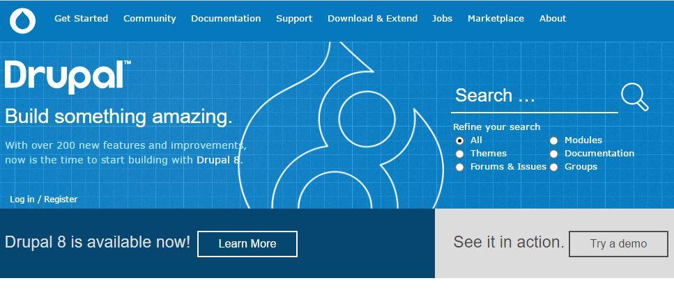

#### Click [Log in / Register](https://www.drupal.org/user)

#### Click [Create new account](https://bitbucket.org/acc_drupal/resources/src/e6afb822da2652cc75e1e1955757ab23e3d82150/manuscript/Create%2520new%2520account)

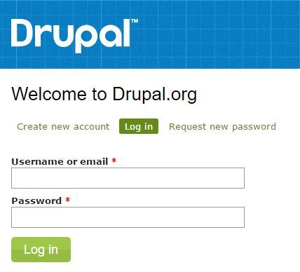

#### Register for a New Account

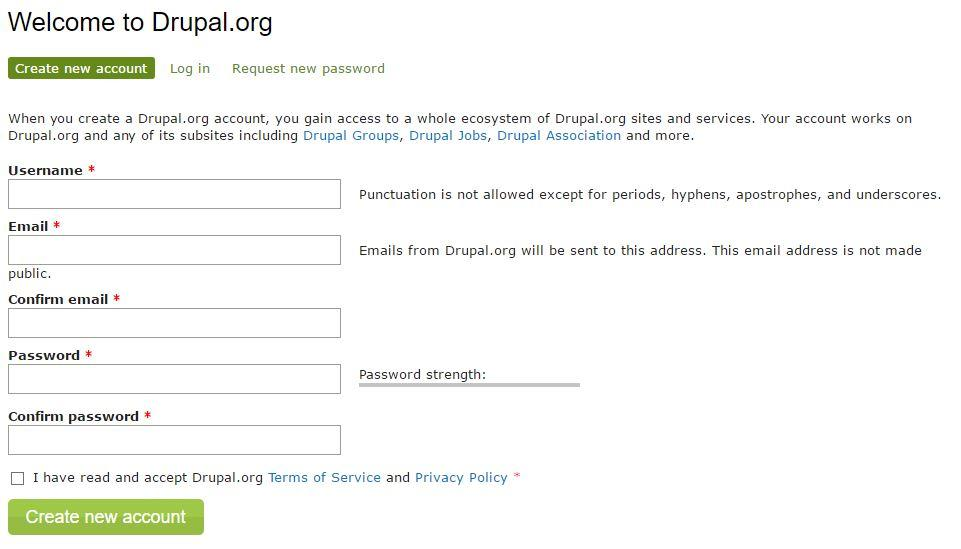

Be sure to read the [Terms of Service](https://register.drupal.org/terms) and [Privacy Policy](https://register.drupal.org/privacy) before creating your account.

#### Complete your Registration

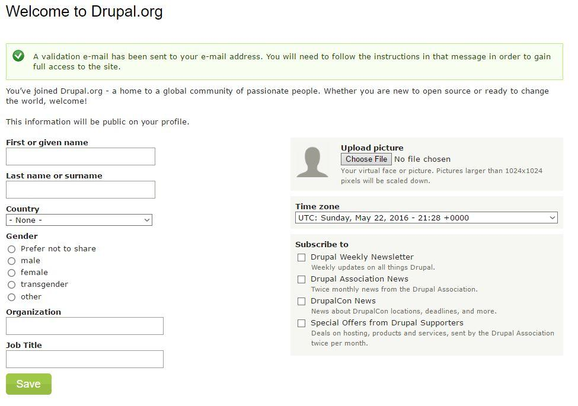

The information provided here need not be your real first and last name, but it is encouraged.

Be aware, everything you enter on this screen will be publically available information.

#### Check Your Email!!

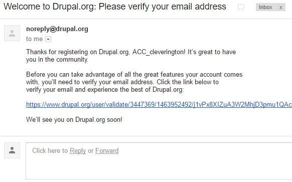

Your Account will not officially be created until you verify your email address.

#### Congratulations!!

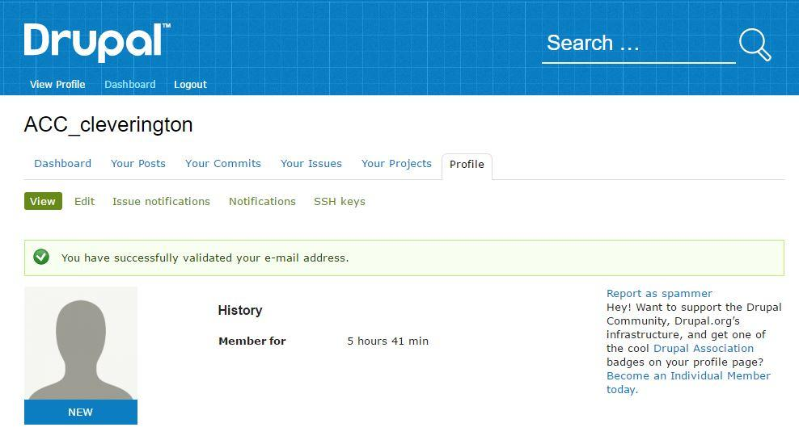

## 0.2.3 Beyond Drupal.org

Creating an account with *Drupal.org* is merely the first step into a fantastic Community of Developers, Web Authors, Content Editors, Marketers, and many, many more.

Another great resource for getting a leg up in the Drupal Community is joining the [Drupal Association](https://assoc.drupal.org/). Drupal Association members get perks like reduced price training, access to the 'pulse' of Drupal via the Drupal Newsletter, and (sometimes) special offers on early-access to events like DrupalCons or DrupalCamps. The Newsletter is also a great resource for learning about local events in your own community for supporting and developing great products.

## 0.2.5 Further Reading

* [Drupal Association](https://assoc.drupal.org/) - Known as the DA, the Drupal Association roots the heart and soul of the Drupal Community by fostering and supporting Drupal projects, marketing Drupal to new users, supporting Drupal infrastructure through events like DrupalCons & DrupalCamps, and a lot more!

* [Get Started with Drupal](https://www.drupal.org/start) - Here you'll find quick-links to all of the most popular extensions, documentation, and support resources for new Drupal users.

# 0.3 Creating a BitBucket Account

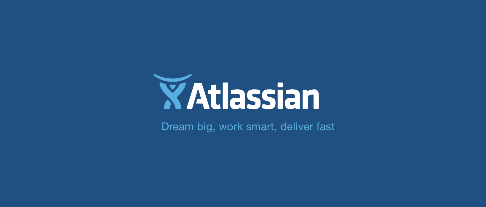

## Prerequisites

An email address for account verification.

## 0.3.1 Learning Objectives

### At the end of this section, you will be able to:

* Create an account at *BitBucket.org*

* Open Git Bash

* Learn the basics of SSH Keys and Secure Deployment

* [Generate an SSH Key](https://confluence.atlassian.com/bitbucket/set-up-ssh-for-git-728138079.html)

* Add SSH Key to your BitBucket Account

## 0.3.2 [BitBucket.org/ vs Other Repositories](https://bitbucket.org/)

There are a number of Git repositories online where an account can be created, such as GitHub, BitBucket, and GitLab. They each have their upsides and downsides. What is important for this course is to understand *how* to use the following:

* Git Bash

* Pantheon.io

* BitBucket.org

* SourceTree

In that order, with a heavy focus on the first two.

That's it.

Real projects in the business world require careful navigation between Branches, Projects, Upstreams, Downstreams, Tags, and many other buzzwords. These real-world scenarios though will generally all have two things in common, if using Git: **Documentation** and **Workflow**.

Trying to remember all of the buzzwords this early is like trying to be ready for that Living Art 101 class with brain-wracking puzzlement over why you need to remember three dozens *places* paintings were made.  

Because each online Repository is unique, they each have their own naming conventions for common tasks. This curriculum will follow BitBucket terminology, so keep this in mind if choosing to use GitHub or GitLab.

<table>
  <tr>
    <td>BitBucket</td>
    <td>GitLab</td>
    <td>GitHub</td>
    <td>Definition</td>
  </tr>
  <tr>
    <td>Pull Request</td>
    <td>Merge Request</td>
    <td>Pull Request</td>
    <td>This task pulls in a specified Branch and applies the differences to the currently active Branch.</td>
  </tr>
  <tr>
    <td>Snippet</td>
    <td>Snippet</td>
    <td>Gist</td>
    <td>BitBucket and GitLab definitely have the better definition here. A 'Gist' or 'Snippet' is simply a chunk of code, whether a single script or patch, that is just too small to include within a full repository.</td>
  </tr>
  <tr>
    <td>Repository</td>
    <td>Project</td>
    <td>Repository</td>
    <td>The Repository is (should be) your complete Project, from source code to documentation.</td>
  </tr>
  <tr>
    <td>Teams</td>
    <td>Groups</td>
    <td>Organizations</td>
    <td>A project is added into Teams (or an Organization) to add group-level Administration. Adding your Git Repository for this class to the Repository assigned by your professor, for example, would add you to the Team created for the class and give you access to all Projects for that Team.</td>
  </tr>
</table>

## 0.3.3 Step-By-Step Account Creation

### Step 1 - Create the Account

Creating an account at bitbucket.org is only the first step in creating a *useable* account for this course.

Once your join the Team managed by your Instructor, however, it will provide you with many resources for learning and collaboration such as example code, pre-defined configuration files for building VMs, Cheat Sheets, and more.

### Creating an Account at [BitBucket.org](https://bitbucket.org/)

#### Open any modern web-browser.

#### Navigate to *[BitBucket.or*g](https://bitbucket.org/)

#### Click the green *Get Started* button at the center or top-right of the screen.

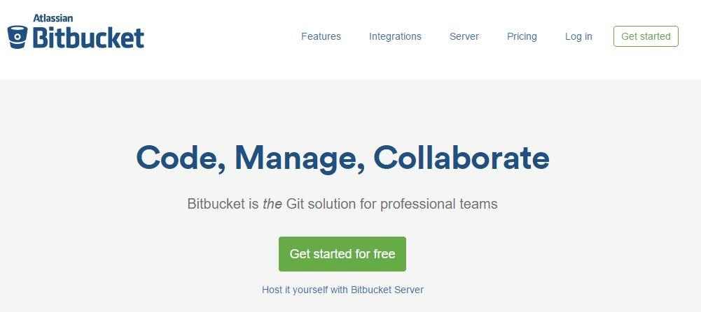

#### Enter email and click *Continue*

**Note** - To take advantage of all the tools and learning opportunities within this course, you must register with a .edu email address.

#### Enter Details and Click *Continue*

#### Check your inbox to verify your email

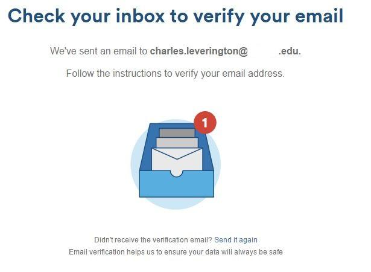

Once you verify your email, also send your Instructor an email with your BitBucket account name so that you can be added to the class Team.

This gives access to all of the Team Repositories and Projects.

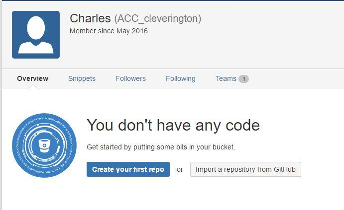

### Step 2 - Create an SSH Key

SSH keys are the digital versions of the car-clicker that unlocks your car as you approach it. Instead of plugging the key into the door (aka: typing a password), you instead create a keycard called an **SSH Key **and add a copy of the Public version to BitBucket. Their computers will compare the Public version they have with the Private version you have, then unlock the car!

Just like with your real car, you don't have to know **how** the clicker unlocks the car.

You should instead simply understand that it **does** unlock the car.

#### Generating an SSH Key

The ~/ means "current user's root folder" or "your home folder". This is important because the files created at ~/.ssh are only visible and available to you and people who have Administrator access to the computer where it was installed.

This means that all SSH Keys should be removed from your BitBucket account at the end of the Semester, just to be safe!

#### Check for existing SSH Keys

It is always best to check for existing SSH Keys before starting *any* project. Especially if creating a new project on a computer you have never logged into before. If a Key already exists, contact your Administrator immediately because there is probably a virus on the computer.

The key is created in relation to each *individual* login to a computer, so will located at C:\Users\<your-user-name>\.ssh\. This means that all the other SSH Keys created on the machine do not exist, in the purview of each Student.

On Linux or Mac machines, this location is instead /home/<your-user-name>/.ssh or something very similar.

### Step 3 - Generate the SSH Key

#### Open Git Bash

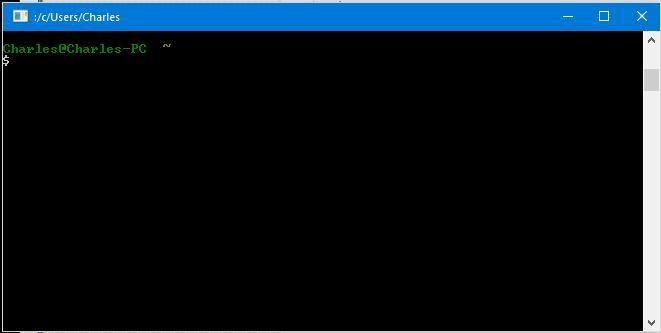

#### Enter this Command: SSH-KEYGEN -T RSA -B 4096 -C "YOUR_EMAIL@EXAMPLE.COM"

When prompted for a location to place the file, just press Enter. 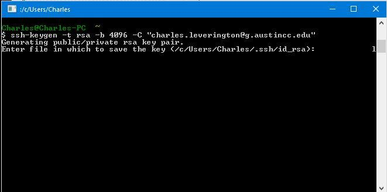

Because this SSH Key can be used for **all** of your Git repositories (and Remote Hosts), it does not matter what directory you are in when the command is executed.

##### When Prompted, enter a passphrase, for security

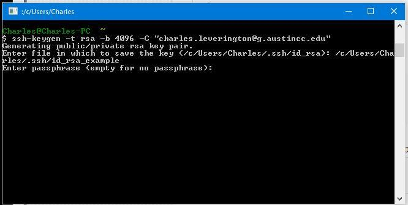

**Warning** - You *can* hit enter here to have **no** passphrase on your SSH Keys. This is not a Best Practice because anyone who retrieves a copy of your SSH Key (such as an Administrator or another User with Administrative privileges) has unlimited access to any of your repositories.

#### Add the SSH Key to ssh-agent

Git for Windows and Git Bash come with a great tool called ssh-agent.

This useful package locally stores *your* SSH information so that you do not have to input your BitBucket password each time you push or pull content from BitBucket.

##### TURN ON THE SSH-AGENT

###### Only on Git for Windows * Enter this command: ssh-agent -s

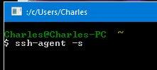

**Note** - On Git Bash, the SSH-Agent is already activated, but you can check your PID using the following command:

$eval "$(ssh-agent -s)"

 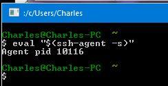

##### **ADD SSH KEY TO ****SSH-AGENT**

* Enter this command: ssh-add ~/.ssh/id_rsa

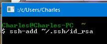

### Step 4 - Add the SSH Key to BitBucket

## 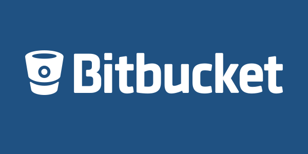

#### Adding the SSH Key to *[BitBucket.co*m](https://bitbucket.com/)

##### Open any modern web-browser.

#### Navigate to *[BitBucket.co*m](https://bitbucket.com/) and Login

#### Open BitBucket Settings and Navigate to SSH and GPG Keys Link

##### View Profile & Open BitBucket Settings

##### Navigate to SSH KEYS link

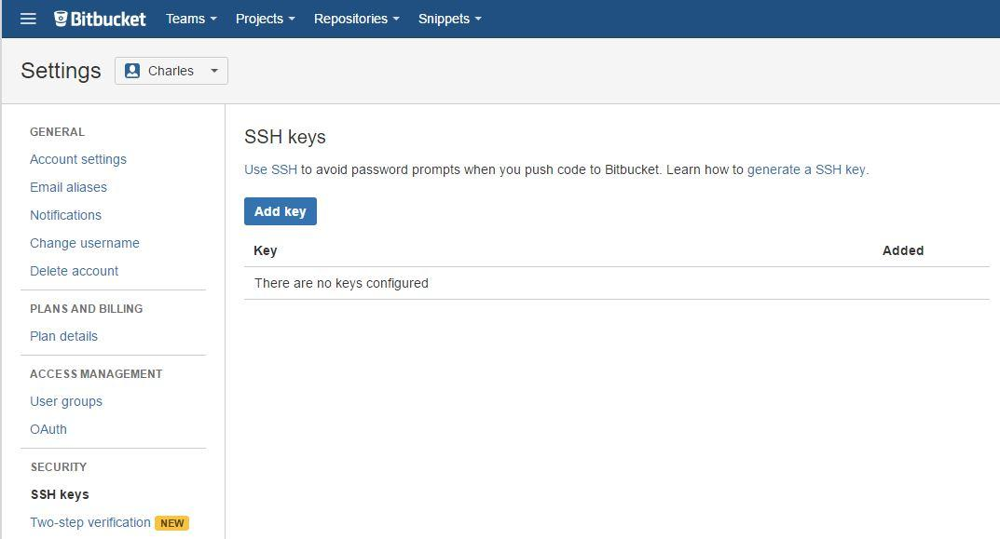

#### Click *Add Key*

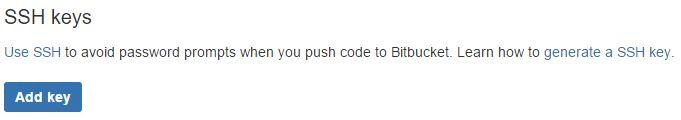

#### Enter SSH Key

Use a Title that will specify exactly what Device you are accessing your BitBucket account with.

Example: ACC-Computer_Lab_Seat_5

##### Get *PUBLIC *SSH KEY for BitBucket

You must have the *right* text to enter into BitBucket. There were two files created with your SSH Key: id_rsa and id_rsa.pub.

The .pub stands for **public** in this instance and will be the file used. Instead of the complicated process of trying to find the file on your local system, there is a very quick and short command you can execute within Git Bash to retrieve the code for pasting in BitBucket: 

clip < ~/.ssh/id_rsa.pub

If successful, you will see a screen similar to this:

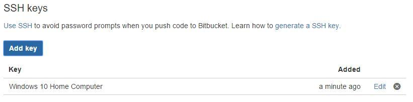

## 0.3.4 Wrap-Up

### In this section, you learned that:

* SSH Keys are important for security and are your digital ‘footprint’ to the wide world of Secure Web Authoring

* Git is one of the more important pieces of software that divides *good* Drupal Site Builders and Web Authors from *great* Drupal Site Builders and Web Authors.

## 0.3.5 Further Reading

* **Git**

* [Git-SCM = Pro Git](https://git-scm.com/book/en/v2) - The entire Pro Git book by Scott Chacon and Ben Straub (published by Apress) has been made available online as a free resource for interested Git users.

* [GitHub Guides = Hello World](https://guides.github.com/activities/hello-world/) - Taking the **Hello World** approach to learning what Git is and how to use it. For those without programming experience, any time you learn a new language the *first* program you will always create is one that simply prints "Hello World" on the screen.

* [Git-Hub = Generate an SSH Key](https://help.github.com/articles/generating-an-ssh-key/)

* [BitBucket = Generate an SSH Key](https://confluence.atlassian.com/bitbucket/set-up-ssh-for-git-728138079.html)

* [BitBucket = How to install a public key on your Bitbucket Cloud account](https://confluence.atlassian.com/bitbucket/how-to-install-a-public-key-on-your-bitbucket-cloud-account-276628835.html) 

# 0.4 Creating a [Pantheon.io](https://pantheon.io/) Account

## Prerequisites

* Git Bash or Git For Windows must be installed.

* An email address for account verification.

* SSH Key creation.

* See [Section 1.1.2: Creating a GitHub Account](https://bitbucket.org/acc_drupal/resources/src/e6afb822da2652cc75e1e1955757ab23e3d82150/manuscript/manuscript/creating-github-account.md)

## 0.4.1 Learning Objectives

### At the end of this section, you will be able to:

* Create an account at *Pantheon.io*

* Verify created account via email

* Upload local SSH Key to Pantheon.io remote repository

## 0.4.2 Create the Account

### Open any modern web-browser.

### Navigate to [Pantheon.io](https://pantheon.io/)

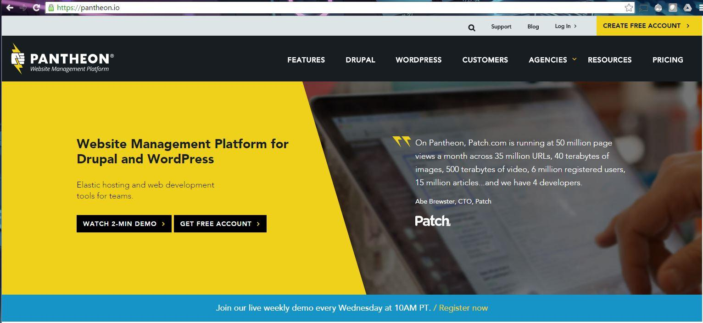

#### Click the yellow CREATE FREE ACCOUNT button at the top-right of the screen.

### Click Connect with Google

For those Students with Google accounts, it is often best to simply click the *Connect with Google* button.

#### ALLOW PANTHEON TO CONNECT WITH GOOGLE

#### CREATE YOUR FREE ACCOUNT (WITHOUT GOOGLE)

For those Students without Google accounts, standard account creation is still acceptable.

#### Complete Account Creation

## 0.4.4 Further Reading

* [Drupal Association](https://assoc.drupal.org/) - Known as the DA, the Drupal Association roots the heart and soul of the Drupal Community by fostering and supporting Drupal projects, marketing Drupal to new users, supporting Drupal infrastructure through events like DrupalCons & DrupalCamps, and a lot more!

* [Get Started with Drupal](https://www.drupal.org/start) - Here you'll find quick-links to all of the most popular extensions, documentation, and support resources for new Drupal users.

# 0.5 Drupal - An Introduction

My other in-development book has the following quote and I will always stand by it:

"One does not need to know any JavaScript to become a Drupal Site Builder and the HTML/CSS knowledge requirements are small at-best."

### Dries - In the Beginning

*More information can be found **[her*e](https://www.drupal.org/node/297669)*.*

Though *officially* 15 years of age, during the creation of this curriculum, the software which would later **become** Drupal was first created by Founder Dries Buytaert some time in 1998, almost "by accident". As a college student at the University of Ghent, Dries felt the need for a more solid (and reliable) Message Board not plagued by the spam-content of sites like MySpace.com or LiveJournal.com.

This "Message Board" gained Dries a lot of interest and feature requests over the next few years, until he decided to create the Open Source Software "Drupal" was born based on the name of the first *online *site powered by Drupal: Drop.org.

On April 26, 2001, a member of the growing Drupal community gifted Dries the iconic site "Drupal.org" as a place for support, documentation, and application storage for Drupal.

As of August 2011, Drupal.org counts itself with over 630,000 subscribed members.

As an interesting aside on the **state** of Drupal, Dries Buytaert has always maintained ownership of Drupal, even after the software reached over fifteen years of age with such notable sites as the WhiteHouse, the University of Texas at Austin, the University of Minnesota, RedHat, the Economist, Bruno Mars, the entire City of Los Angeles, and Weight Watchers.

### In Short

Drupal is, as stated within the last section, a Content Management System.

The question is not what it **is**, the question is what it **can be**!

<table>
  <tr>
    <td>Beginner</td>
    <td>Intermediate</td>
    <td>The Future</td>
  </tr>
  <tr>
    <td>Websites, Web Pages, and Blogging</td>
    <td>Dynamic Content Generation</td>
    <td>Cross-channel immersive digital experiences</td>
  </tr>
  <tr>
    <td>Web Browsers and Forums</td>
    <td>SmartPhones and Multi-Site Content Aggregation</td>
    <td>Any screen, any device, any content, any application</td>
  </tr>
  <tr>
    <td>Pre-Defined and Semi-Static Content</td>
    <td>Device and Browser specific Content Generation</td>
    <td>Personal, contextual experiences custom-built for each person</td>
  </tr>
  <tr>
    <td>Full-Stack Development</td>
    <td>Partially decoupled with extensible Front-Ends</td>
    <td>Delivered with any software package to any device</td>
  </tr>
</table>

It is a platform for custom-crafting digital experiences.

Welcome to the **Internet of Things.  **Welcome to **Modularity**

**Welcome to Drupal**

# 0.6 The Workflow

From the words of Pantheon.io: 

*Code Moves Up, Content Moves Down*

The core of the Pantheon workflow is to move **Code** up from Dev to Test to Live and **Content **down from Live to any other environment.

Drupal 7 and Pantheon both have many great tools for achieving this workflow, each with upsides and downsides.

Pantheon, for example, sports a Multidev environment, which exploits Git’s Branching functionality to support multiple prototyping environments with only the *approved* prototypes even reaching the Dev Environment.

Within this Course, we instead use *Local* Environments and an alternative Remote Git Repository to support the same functionality. Both methods require creating a git branch with file changes for testing. Pantheon’s method requires specific naming conventions on the branch however and should be researched prior to creating the prototype branch. 

On Pantheon’s System, **_only_*** *the master branch will be available / used by the Dev, Test, and Live environments. Performance, Usability, etc. testing should be formed *locally* then pushed to master using Git. 

### Example Prototyping Workflow

**Note **- The following is the *culmination* of the Workflow in this Class and will not be important until the **end** of Unit Five. Just be *aware* of it now and reference, when needed.

<table>
  <tr>
    <td>This Course
Add file changes to Local Environment.
Use git checkout to switch to your prototype branch.
commit changes and push to BitBucket (in case checkout is needed).
Make changes, as necessary.
When Code is ‘Approved’ for Testing, commit changes and push to BitBucket.
Use git checkout to switch to the master branch.
pull changes to master branch.
Test Locally by using drush site-install, drush sql-sync, drush enable, then drush cc all. 
push to Pantheon.io, Dev Environment.
 When Code is ‘Approved’ for Deployment, use the Pantheon.io Site Dashboard to Sync Code from Dev to Test.</td>
    <td>Pantheon.io
From Site Dashboard, click the Multidev tab.
Click Git Branches.
Specify the name, select the Source (Dev, Test, or Live), and click Create Environment. 
Edit Code, as needed, either via local Git or SFTP mode.
Make changes, as necessary.
When Code is ‘Approved’ for Deployment, click Merge on the Branch Environment you wish the Code merged into for testing.</td>
  </tr>
</table>

<table>
  <tr>
    <td>Code (within this specific context) includes:
plugins, 
modules, 
themes, 
CSS, 
JS
anything that's under Git version control.</td>
    <td>Content (within this specific context) includes:
files not under Git version control, like:
images, 
PDFs, 
the database where your Drupal data is stored.
Note - Default images are often included as part of Profiles/Deployments and would be considered part of the docroot (aka ‘Code’ or ‘Theme’) as opposed to Content.</td>
  </tr>
</table>

# 0.7 Foreword and Introduction Summary

In the Introductory Unit, Web Authoring was light and knowledge building was heavy.  

In Unit One, we will dig into the *meat* of Web Authoring and creating Dynamic Websites with Drupal.

## In this unit, you learned:

* Drupa.org is is a site maintained (and owned) by the Drupal Association for the betterment and improvement of the Drupal Community;

* BitBucket.org is a free online Git Version Control with unlimited Private Repositories for users with email addresses ending in ".edu";

* Pantheon.io is a PaaS (Platform as a Service) hosting serviced offered by Drupal and Wordpress enthusiasts;

* Drupal Module installation;

* the modularity/flexibility in maintaining the Drupal docroot using Git Version Control;

