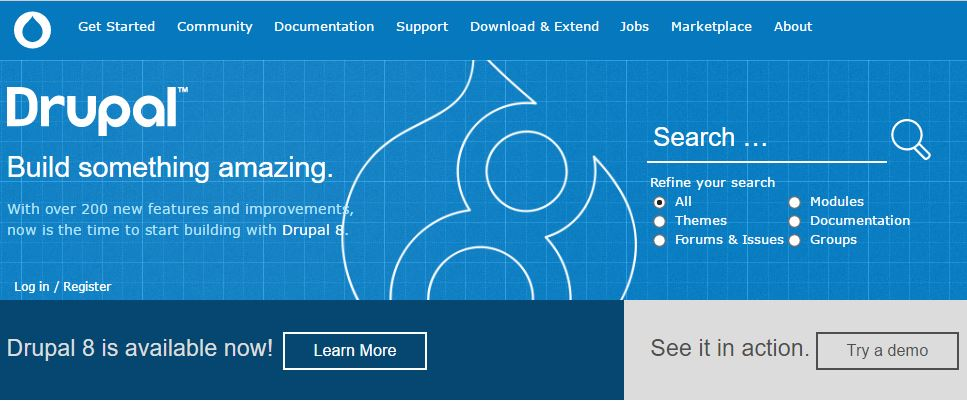
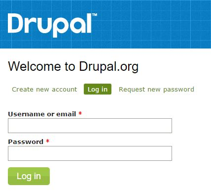
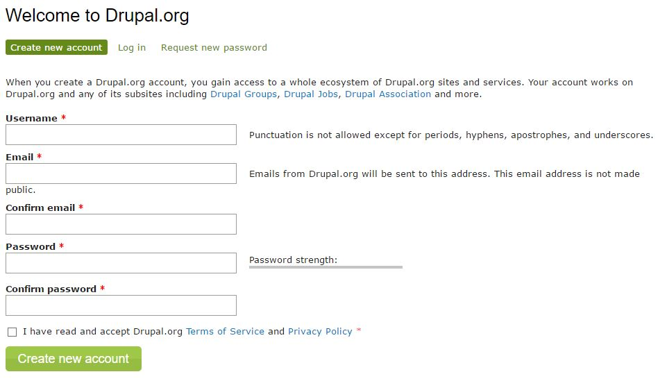
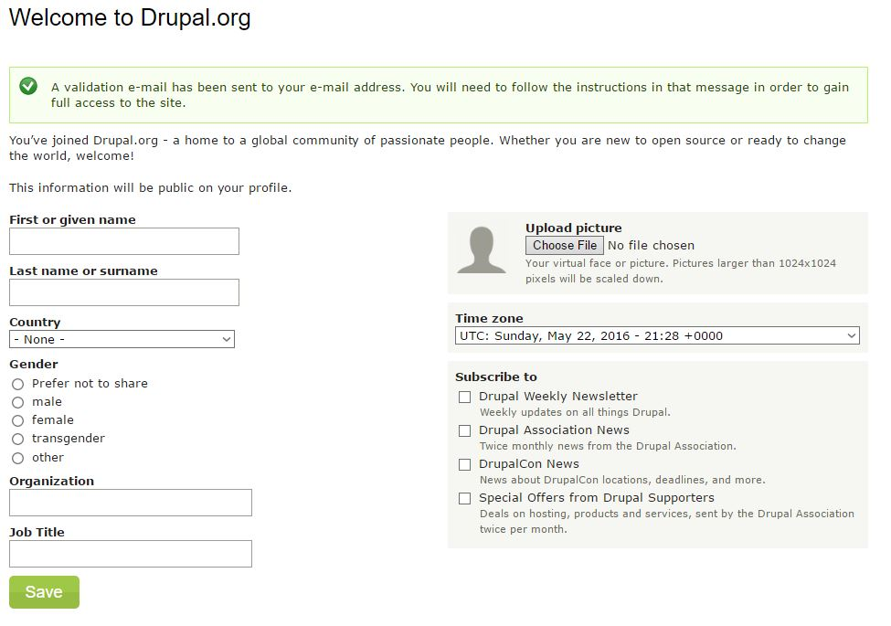
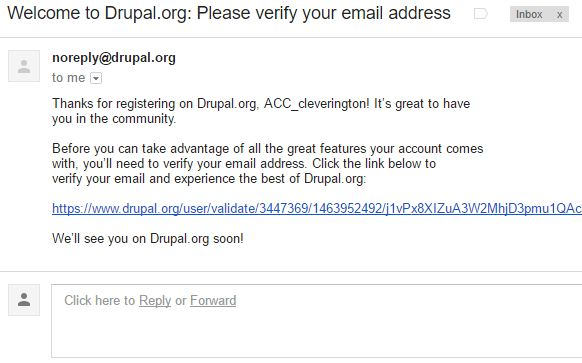
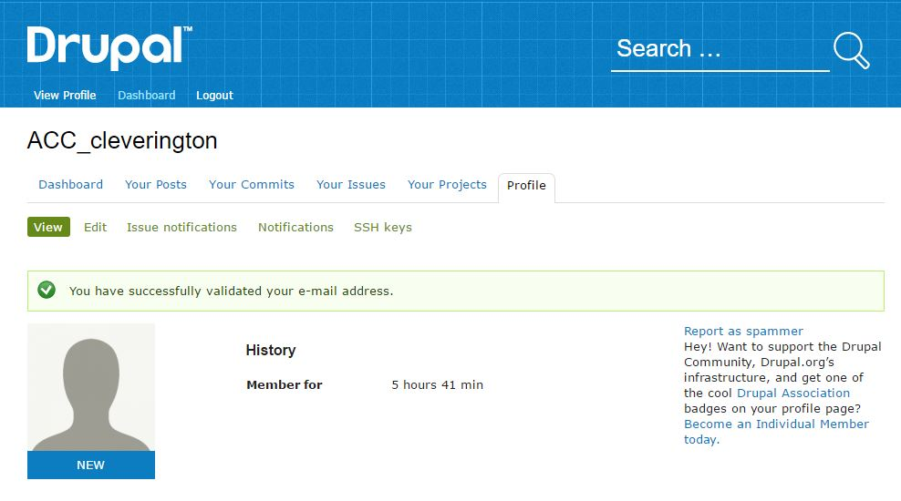

# Joining *Drupal.org*

## Prerequisites

An email address for account verification.

## Goals

* Create an account at *Drupal.org*
* Verify created account via email

## Creating a Drupal Community Account

#### Open any modern web-browser.

#### Navigate to [Drupal.org](https://www.drupal.org "Drupal.org")

#### Click [Log in / Register](https://www.drupal.org/user "Log in / Register")

#### Click [Create new account](Create new account "Create new account")

#### Register for a New Account

> Be sure to read the [Terms of Service](https://register.drupal.org/terms "Terms of Service") and [Privacy Policy](https://register.drupal.org/privacy "Privacy Policy") before creating your account.

#### Complete your Registration

> The information provided here need not be your real first and last name, but it is encouraged.

> Be aware, everything you enter on this screen will be publically available information.

#### Check Your Email!!

> Your Account will not officially be created until you verify your email address.

#### Congratulations!!

## Beyond Drupal.org

Creating an account with *Drupal.org* is merely the first step into a fantastic Community of Developers, Web Authors, Content Editors, Marketers, and many, many more.

Another great resource for getting a leg up in the Drupal Community is joining the [Drupal Association](https://assoc.drupal.org "Drupal Association"). Drupal Association members get perks like reduced price training, access to the 'pulse' of Drupal via the Drupal Newsletter, and (sometimes) special offers on early-access to events like DrupalCons or DrupalCamps. The Newsletter is also a great resource for learning about local events in your own community for supporting and developing great products.

## Further Reading
 * [Drupal Association](https://assoc.drupal.org "Drupal Association") - Known as the DA, the Drupal Association roots the heart and soul of the Drupal Community by fostering and supporting Drupal projects, marketing Drupal to new users, supporting Drupal infrastructure through events like DrupalCons & DrupalCamps, and a lot more!
 * [Get Started with Drupal](https://www.drupal.org/start "Get Started with Drupal")  - Here you'll find quick-links to all of the most popular extensions, documentation, and support resources for new Drupal users.
