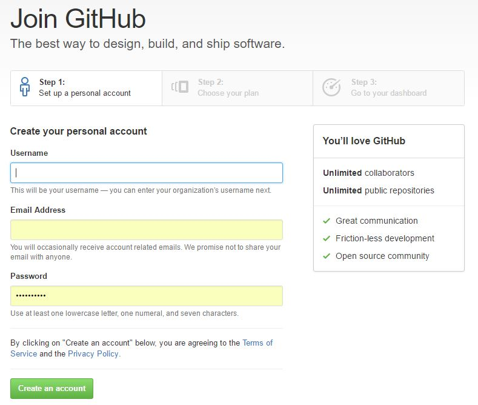
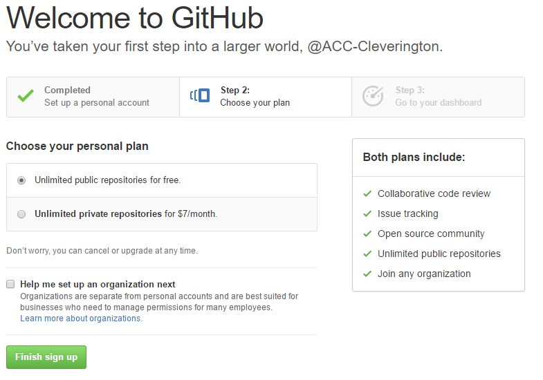

# Creating a GitHub Account

## Step 1 - Create the Account

Creating an account at GitHub.com is only the first step in creating a *useable* account for this course.

### Creating an Account at [GitHub.com](https://github.com "GitHub.com")

#### Open any modern web-browser.

#### Navigate to [GitHub.com](https://github.com "GitHub.com")

#### Click the green _Sign Up_ at the top-right of the screen.

#### Enter registration information and click _Create An Account_.

#### Select personal plan and click _Finish sign up_.

