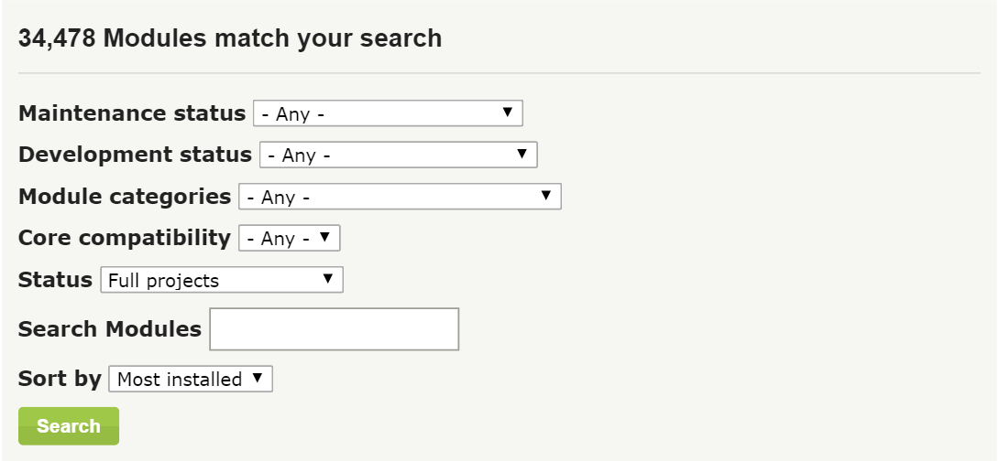
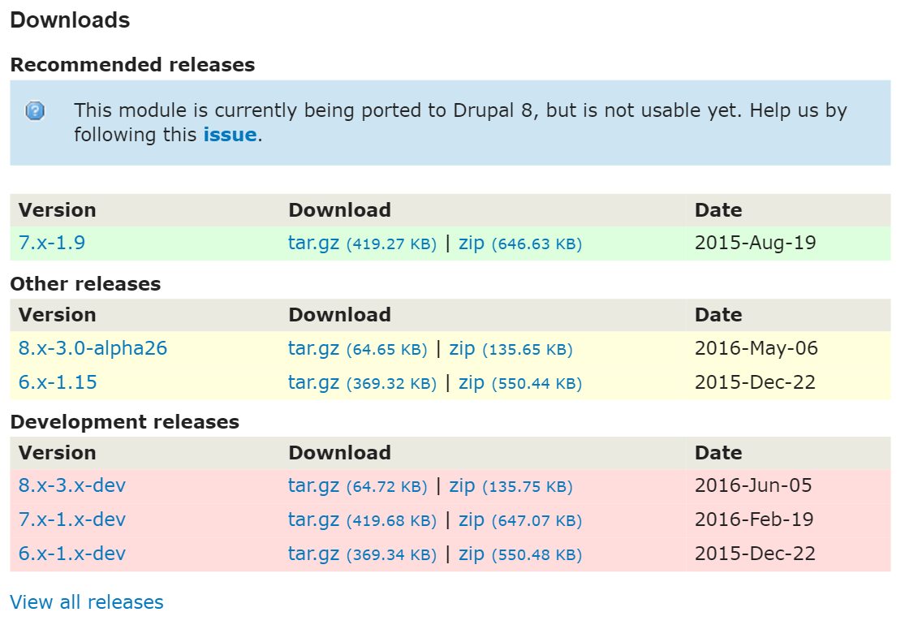
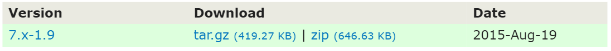
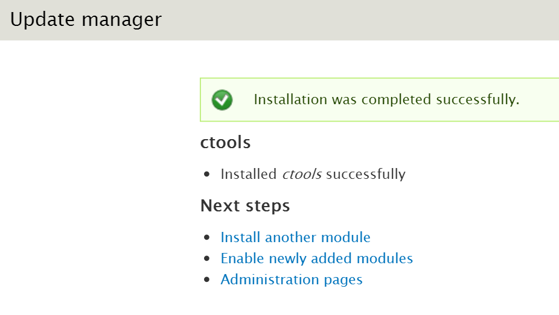

# Installing Modules


## GUI : Step 1 - Download CTools

#### Open any modern web-browser.


#### Navigate to https://mysite.pantheon.io/admin/config/development/performance (*admin/config/development/performance*) and Clear Caches
Before you do anything, it is always best to clear your caches!

#### Navigate to [Drupal.org's Module Project page'](https://drupal.org/project/project_module "Drupal.org's Module Project page") at https://drupal.org/project/project_module


#### Search for CTools, located at [https://www.drupal.org/project/ctools](https://www.drupal.org/project/ctools)
Created by the more than amazing Drupal.org user [merlinofchaos](https://www.drupal.org/u/merlinofchaos "merlinofchaos"), the [CTools](https://www.drupal.org/project/ctools) module is an excellent introductory module to install for the class because it is one of the main contributed modules used by Drupal 7 Web Authors worldwide. [CTools](https://www.drupal.org/project/ctools) is a dependency for many popular modules, such as [Views](https://www.drupal.org/project/views) and [Display Suite](https://www.drupal.org/project/ds) (which are used in this course).



#### Choose a CTools download.
There are, typically, three stages for Drupal extensions hosted on Drupal.org:

| Stage  | Color  | Status   | Notes  |
| :-------------: |:-------------:| :-----:|:--: |
| Dev  | Red  | Dev releases are *functionally* ready for installation, but have compatibility issues, major tickets in the Issue Queue (such as Security Vulnerabilities or non-functional errors).   | Be very careful if ever installing modules still in Development status. Many, **many** modules over the years have never managed to expand beyond dev-status. The causes are many, but the most common are a lack of Contributors or a better version of the modules functionality available within a different module.   |
| Alpha  | Yellow  | Alpha releases are, for the most part, ready for publication, yet may still have major tickets active within the Issue Queue that do *not* cause functionality loss except within specific situations.   | Alpha Modules are, generally, okay to install, but be aware that well maintained modules **rarely** stay in *Alpha* status for very long, which may require an inconvenient update.  |
| Beta  | Yellow  | Beta releases, just like in the real world, are Extensions that the Contributors feel confident are *ready* for live sites.   | Many Drupal 6 modules, for example, never actually **left** Beta status because the Contributors never managed to bring the Issues down enough to create a Release Candidate. Beta Releases are more *reliable* than Alpha Releases, certainly, but savvy Web Authors always check the Issue Queues before installing unknown modules.  |
| Release  | Green  | Release Candidates are the 'published' version of the Project (Module, Theme, Distribution, etc.).  | Green means go!  Bear in mind though, there has never been a piece of software **ever** created that matches the requirement of 'perfect'. There never will be either. Continual Improvement.  |



> **Best Practice** - Drupal provides a search feature for *Most Installed*. When searching for specific tools to install, the *Most Installed* are **generally** the best choice, but savvy Web Authors will always check to see just how maintained their chosen module is. CTools, for example, was updated within three most of creating the curriculum for this course.


#### Download CTools.
Download either the tar.gz file or the zip file for the project.



#### Unpack CTools


#### Move CTools into your Drupal installation
Copy the CTools folder (```Select, then Ctrl + C```) and paste it within your Drupal installation at ```/root/sites/default/modules/contrib/```.

> **Note** - There are many places where a Drupal extension *can* be placed and they are very important for understanding Drupal's modularity, but for now we will be installing CTools in the most *default* location.


#### Navigate to https://mysite.pantheon.io/admin/config/development/performance (*admin/config/development/performance*) and Clear Caches
Before you do anything, it is always best to clear your caches!

> **Troubleshooting** - This is the most likely step where you might run into errors / issues when installing and enabling new extensions (modules *or* themes). If you receive the dreaded **WSOD** (*W* hite *S* creen *o* f *D* eath), simply delete the installed modules within your *sites/../modules/contrib/* folder. Once you clear the caches again, the error caused by the bad code should be removed.

#### Congratulations!


Congrats! You have successfully **installed** a module.

Next, however, you need to **enable** the module.

#### Navigate to https://mysite.pantheon.io/admin/modules


#### Search for CTools and Enable
CTools, as a very expansive contrib module, actually includes a number of useful modules all packaged in.  

For now, only enable 'Chaos Tools' and Click *Save Configuration*.

> **Troubleshooting** - This is the second most common place where errors occur when installing and enabling extensions.

## Power User Challenge!
#### Add CTools to Git!
