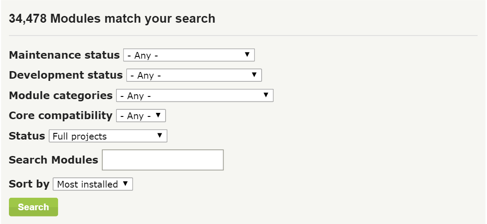
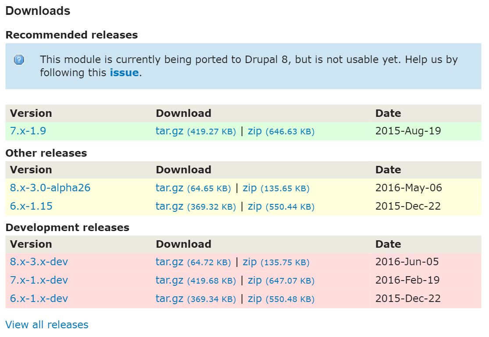
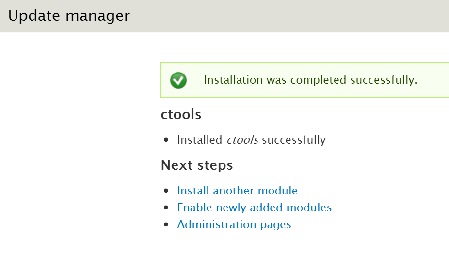

# Installing Modules

## Pantheon.io : Step 1 - Download CTools

#### Open any modern web-browser.

#### Navigate to [Drupal.org's Module Project page'](https://drupal.org/project/project_module "Drupal.org's Module Project page") at https://drupal.org/project/project_module

#### Search for CTools, located at [https://www.drupal.org/project/ctools](https://www.drupal.org/project/ctools)
Created by the more than amazing Drupal.org user [merlinofchaos](https://www.drupal.org/u/merlinofchaos "merlinofchaos"), the [CTools](https://www.drupal.org/project/ctools) module is an excellent introductory module to install for the class because it is one of the main contributed modules used by Drupal 7 Web Authors worldwide. [CTools](https://www.drupal.org/project/ctools) is a dependency for many popular modules, such as [Views](https://www.drupal.org/project/views) and [Display Suite](https://www.drupal.org/project/ds) (which are used in this course).

#### Choose a CTools download.
There are, typically, three stages for Drupal extensions hosted on Drupal.org:

| Stage  | Color  | Status   | Notes  |
| :-------------: |:-------------:| :-----:|:--: |
| Dev  | Red  | Dev releases are *functionally* ready for installation, but have compatibility issues, major tickets in the Issue Queue (such as Security Vulnerabilities or non-functional errors).   | Be very careful if ever installing modules still in Development status. Many, **many** modules over the years have never managed to expand beyond dev-status. The causes are many, but the most common are a lack of Contributors or a better version of the modules functionality available within a different module.   |
| Alpha  | Yellow  | Alpha releases are, for the most part, ready for publication, yet may still have major tickets active within the Issue Queue that do *not* cause functionality loss except within specific situations.   | Alpha Modules are, generally, okay to install, but be aware that well maintained modules **rarely** stay in *Alpha* status for very long, which may require an inconvenient update.  |
| Beta  | Yellow  | Beta releases, just like in the real world, are Extensions that the Contributors feel confident are *ready* for live sites.   | Many Drupal 6 modules, for example, never actually **left** Beta status because the Contributors never managed to bring the Issues down enough to create a Release Candidate. Beta Releases are more *reliable* than Alpha Releases, certainly, but savvy Web Authors always check the Issue Queues before installing unknown modules.  |
| Release  | Green  | Release Candidates are the 'published' version of the Project (Module, Theme, Distribution, etc.).  | Green means go!  Bear in mind though, there has never been a piece of software **ever** created that matches the requirement of 'perfect'. There never will be either. Continual Improvement.  |

> **Best Practice** - Drupal provides a search feature for *Most Installed*. When searching for specific tools to install, the *Most Installed* are **generally** the best choice, but savvy Web Authors will always check to see just how maintained their chosen module is. CTools, for example, was updated within three most of creating the curriculum for this course.

#### Navigate to https://mysite.pantheon.io/admin/config/development/performance (*admin/config/development/performance*) and Clear Caches
Before you do anything, it is always best to clear your caches!

#### Navigate to https://mysite.pantheon.io/admin/modules and Click *Install new module*

#### Paste URL and Click *Install*

#### Congratulations!

## Power User Challenge!
#### Add CTools to Git!
