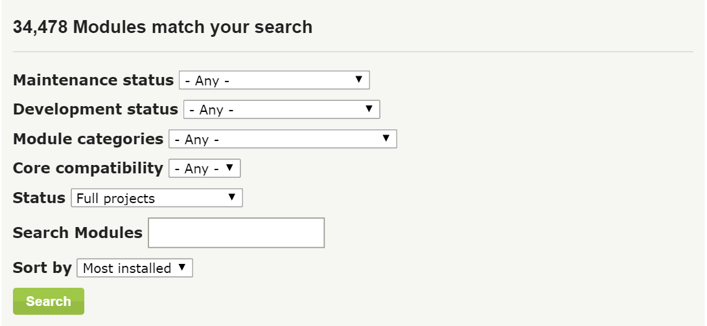

Modern Drupal 7 Web Authoring

Unit One

By: Charles Leverington & Fito Kahn

**Modern Drupal 7 Web Authoring - Unit One**

Published by Charles Richard Leverington & Adolph "Fito" Kahn © 2016 (Pending)

Your feedback is welcome and we are always open to suggestions for updating our Curriculum. Please do not hesitate to tell us about your experience using the form included within the Appendix or handed out by your Instructors in the middle and at the end of the course.

[[TOC]]

# Unit One: Preparing Your Development Environment

* **Week One: Overview & Development**

    * Foreword

        * Section One: Introduction

        * Section Two: Early Development

        * Section Three: Joining *Drupal.org*

        * Section Four: Creating a BitBucket Account

        * Section Five: *Pantheon.io* Account

        * Section Six: Drupal Overview

        * Section Seven: System Requirements

        * Section Eight: The Workflow

    * Unit One: Preparing Your Development Environment

        * Section One: Content Management Systems

        * Section Two: Drupal - An Introduction

        * Creating Your First Site

        * Adding a Git Workflow to Your Site

        * Creating Your Local Server

* **Week Two: Local Development and Drupal Site Building**

        * Extending Drupal

        * Installing Modules - CTools

        * Installing Modules - Administrative Menu

        * Unit One: Summary

        * Unit One: Further Reading (*Aggregated from all Sections*)

    * Unit Two: Drupal Site Building 

        * Static vs. Dynamic

        * The Drupal Stack

        * Drupal Core Basics

        * User Roles & Permissions

        * Content Types

        * Taxonomy

        * Structured Content

* **Week Three: Views, Menus, & Content Manipulation**

        * Views

        * Site Navigation & URLs

        * URL Aliases

        * The Menu System

        * Module Configuration & Extending Drupal

        * Creating an Event Calendar

        * Custom Error Messages

        * Custom Content Editing Boxes

* **Week Four: Drupal Layout & Contrib Themes**

    * Unit Three: Design Systems, Drupal Layout & Drupal Themes

        * Web Theming Fundamentals & Design Systems 

        * Drupal Theming Fundamentals

        * Customizing Themes

        * Anatomy of a Theme

        * Coding Drupal

        * The Drupal Theme Engine

        * Template Files - Overriding Theme Pieces

        * Add Regions to Themes

        * Base Themes, Starter Themes, Distribution Themes

        * Subtheming

            * Subtheme Inheritance

        * Keep it Zen - The Starter Subtheme

        * Markup & Mini Panels

* **Week Five: CSS in Drupal, Responsive Design, & Design Systems**

        * Using CSS in Your Theme

        * Responsive Web Design

            * Accessibility

            * Responsive Grids & Tables

            * Responsive Images

            * Responsive Slideshows

            * Responsive Videos

    * Unit Four: Panels, Display Suite, & Context

        * Introduction to Panels

        * Creating Drupal Sites with Panels

* **Week Six: Power Panels & the Panalizer**

        * Panel Variants, Views Displays

        * Panels for Forms

        * Understanding the Panalizer & Display Suite Modules

    * Unit Five: Modules

        * Drupal Framework

        * Contrib Modules

* **Week Seven: Final Configurations & Module Development**

        * Creating Modules

        * Featurize and Deploy

        * Configuration Management

        * Distributions

* **Week Eight: Security, Troubleshooting & The Future**

    * Unit Six: Troubleshooting

        * Security Considerations

        * Drupal Caching Tools

        * WSOD - The "White Screen of Death" Errors

    * Unit Seven: 

        * Drupal - The Next Version

        * TWIG

## Buzzwords

Not all things are created equal, and, likewise, not all buzzwords are equally important.

Starting into Web Authoring requires that students recognize a few key buzzwords, where they are used, and where to find more information about them.

### Web Server

If it supports PHP, it supports Drupal.  

Reading from Wikipedia, "A **web server** is a computer system that processes requests via [HTTP](https://en.wikipedia.org/wiki/HTTP), the basic [network protocol](https://en.wikipedia.org/wiki/Network_protocol) used to distribute information on the [World Wide Web](https://en.wikipedia.org/wiki/World_Wide_Web). The term can refer to the entire system, or specifically to the [software](https://en.wikipedia.org/wiki/Software) that accepts and supervises the HTTP requests.

In this course, the Web Server has little meaning beyond *needing* a functional Web Server for local development.  Remember: Green means go.

### Database

Content management systems like Drupal require a database to hold data. The database is simply a [computer software](https://en.wikipedia.org/wiki/Computer_software) application that interacts with the user, other applications, and the database itself to capture and analyze this data. The data is made up of  [schemas](https://en.wikipedia.org/wiki/Database_schema), [tables](https://en.wikipedia.org/wiki/Table_(database)), [queries](https://en.wikipedia.org/wiki/Query_language), reports, [views](https://en.wikipedia.org/wiki/View_(SQL)), and other objects. Similarly to the Web Server, the database used is not all that important for novice Web Authors. More experienced Web Authors and Web Developers will have to choose between versions of MySQL/MariaDB, PostgreSQL, or SQLite, but that is beyond the scope of this course. The important thing to remember for the Database is: Green means go. 

### PHP Version

PHP is a very popular [server-side scripting](https://en.wikipedia.org/wiki/Server-side_scripting) language designed primarily for [web development](https://en.wikipedia.org/wiki/Web_development) but is also used as a [general-purpose programming language](https://en.wikipedia.org/wiki/General-purpose_programming_language). Many content management systems including Drupal are build using PHP. For the novice level Web Author, literally the only thing needed to know in relation to PHP Version is what the version on your site **is**.

This knowledge ensures your Local and Remote Servers are in sync. Just like software that can only be installed on computers that meet certain requirements, Drupal and the other software used in this course can only be installed on systems supporting PHP 5.4 or higher. None of the software used in this course starts support of PHP at anything less than PHP 5.5.33. 

Remember: Green means go. 

### Git Repository

Git is one of the most popular "open source" version control systems used today. It was originally developed in 2005 by Linus Torvalds who also created the Linux operating system. It is a very good idea to use a version control system when working on your site. A version control system like Git  records all your code changes. It allows you to revert those changes back to a previous state, revert an entire project back to a previous state, compare changes over time, and even see who last modified something that might be causing a problem with your code.

This is where your **_Code_** lives. For the purpose of both Security and Redundancy, your Code lives in *three* places:

* The Pantheon.io Git Repository

* The BitBucket.org Git Repository

* The Local Git Repository

Likewise, your *Content* will live in multiple places for Security and Redundancy.

*Security* - If a Hacker manages to break open your Account (via password theft, SQL Injection, etc.) and corrupt everything, your Git Repository on Pantheon.io might not be retrievable. Having a backup on BitBucket.org makes your delivery more stable.

*Redundancy* - Typically known as a *Security* measure, Redundancy also adds an additional layer to maintaining your Code. Pantheon.io is wonderful for accessing your Code, especially with the SFTP Mode and Git’s ability to instantly pull down Code, but what if you’d rather simply *look* at the Code and make small changes? BitBucket.org allows (and supports) this.

#### Remote Repository

In the context of this course, *Remote Repository* could refer to either the Git Repository built into Pantheon.io’s interface or the Private Git Repository at BitBucket.org. 

**Best Practices** - Generally speaking, only finalized Code changes should be pushed up to the Pantheon.io Servers after extensively testing Locally. **Yet**, there is a reason why Pantheon.io has a ‘dev’ (development), ‘test’ (test), and ‘live’ (production) environment workflow. If **_your _**Workflow instead focuses on *developing* on Pantheon.io, still ensure regular backups are made to BitBucket.org. 

#### Local Repository

In the context of this course, the *Local Repository* will refer to the docroot currently being manipulated locally via Acquia Dev Desktop. As multiple sites will be created with *different* docroots by the end of the course, this may refer to multiple docroots connected to multiple BitBucket.org Repositories, but should still live within your ~/Sites/ folder ( */Users/your-username/Sites/* ) on your computer.

### Servers

In the context of this course, you will be using two Servers: the *Remote Server* and the *Local Server*.

#### Parts of a Server

Each Server has multiple parts, which are thankfully streamlined, but you should at least be *aware* of them. Knowledge of how they function, how to interact with each piece, and/or configure/program each piece is mostly unnecessary with the exception of Drupal’s Codebase (which you will learn in this course). 

##### Code - (also known as: docroot, Drupal Codebase)

This is everything that makes your Site ‘YOUR’ site. The Code contains the files that say ‘I am Drupal’ that will be learned throughout this course.

##### Files ( *sites/default/files/* )

Located *within* your Code, but not *actually* Code. Your /files/ folder serves multiple functions for your Drupal Site, most of which are completely system generated/dynamic and require little action on the part of the Web Author. 

##### SQL Backups ( abcd.sql files)

Generally either saved locally or through the amazingly user-friendly GUI interface baked into Pantheon.io’s Dashboard, SQL Backups contain your Site’s *Content* and *Configuration* (which will be defined later). *(If caches were not cleared prior to creating the Backup, they tend to contain huge amounts of cruft as well.)*

#### Remote Server

In the context of this course, the Remote Server will almost always be either Pantheon.io or (if referencing installing modules/themes, etc.) possibly *Drupal.org*. The important thing to remember about the Remote Server is *access*. In this course, we walk you through multiple methods of *accessing* the Remote Server, including a number of GUI based solutions baked into the Pantheon.io Dashboard.

#### Local Server 

In the context of this course, the Local Server will be the folder labelled "Your Site" loaded into (or being loaded into) Acquia Dev Desktop for Configuration and Content Management. Acquia Dev Desktop is a free desktop app that allows you to install, test, and build Drupal sites locally on your computer. Once installed, Acquia Dev desktop setups up a separate local development environment with the following components:

* Apache web server: One of the most popular web servers

* Percona MySQL database server: A popular database server

* PHP: Dev Desktop provides multiple versions of PHP which is the programming language that Drupal uses.

* phpMyAdmin: A popular MySQL management and query tool

* XMail Server (Windows only): An email server that allows your site to send email directly (Mac OS X has this functionality built in).

# 1.0 Creating Your First Site

There are many methods to creating a Drupal 7 site. Some are hard, most are easy.

**Best Practices** - No matter which hosting company or method is chosen, installing Drupal from scratch is almost always unnecessary work. Let one of the software programs built to do so complete the process for you instead.

For **this** course, your first site will be created dynamically by Pantheon.io's site-creation engine. See below for further instruction on sites not hosted on Pantheon.io prior to installation.

## 1.0.1 Learning Objectives

### At the end of this section, you will be able to:

* Create a functional Drupal site for use as a portfolio

* Create Dev, Test, and Live environments on Host Servers (at Pantheon.io)

* Create Git Repository for your Drupal installation on BitBucket.org

* Sync Your Site to SourceTree, for easy Git Version Control

* Turn on Your Site to develop locally

**Note** - For the rest of this course, "*your*" site will be referred to as "*https://mysite.pantheon.io*".

This means that if your site is "*johnsportfolio.pantheon.io*", then instructions for accessing the Administration Menu via *https://mysite.pantheon.io/admin* should instead be read as*johnsportfolio.pantheon.io/admin*.

### Early Reading

* **Beginner:** [Drupal.org - Quick install for beginners](https://www.drupal.org/documentation/install/beginners)

* **Intermediate:** [Drupal.org - Installation Guide](https://www.drupal.org/documentation/install)

* **Advanced:** [Drupal.org - Quick install for developers (command line)](https://www.drupal.org/documentation/install/developers)

## 1.0.2 Step 1 - Creating A Site

### Navigate to Pantheon.io Dashboard

### Click + Create New Site

### Name Your Drupal Site

This site name will be registered under multiple places (unless you've chosen a paid plan, where options become available):

* dev-yoursite.pantheon.io

* test-yoursite.pantheon.io

* yoursite.pantheon.io

### Enter the name of your chosen site and click *Create Site*. 

**Reminder** - For the rest of this course, "*your*" site will be referred to as "*https://mysite.pantheon.io*".

This means that if your site is "*johnsportfolio.pantheon.io*", then instructions for accessing the Administration Menu via **_https://mysite.pantheon.io/admin_** should instead be read as **_https://johnsportfolio.pantheon.io/admin_*** *or, if working from the Dev environment: **_https://dev-johnsportfolio.pantheon.io/admin_**.

That's correct. If you are willing to keep your site under a Pantheon.io URL, you can actually use the **Live **site for showcase purposes. 

**Warning** - Once you pass this step, don't stop until your site is fully created or you will have to wait a few minutes, refresh, delete the newly *uncreated* site, and start again.

### Configure Your Site

From the Site Configuration page, select *Start from Scratch* as we will be creating a fresh Drupal 7 installation for this site. 

For your Portfolio Project, select the *Drupal 7* clean instance and Click *Install Drupal 7*: 

Savvy users will notice that Pantheon allows for many options beyond the Cookie Cutter Wordpress, Drupal 7, or Drupal 8. See the Further Reading for links to the different options for site creation, such as [CiviCRM](https://civicrm.org/), [Commerce Kickstart](https://drupalcommerce.org/commerce-kickstart-2), and [Open Atrium](http://www.openatrium.com/#!/). These are called **Distributions** and are one of the options for installing Drupal.

**Distributions** are pre-configured Drupal "distributions" with customized modules, pre-installed contrib modules, and (often) pre-configured themes for quickly going online with a specific site-instance. The Commerce Kickstart toolkit, for example, is pre-configured to quickly get Web Authors/Developers online and live with PayPal accessible sites (and beyond, if users already have contracts with necessary companies).

Just like all things within Drupal, even the **Distributions** are **Modular**. [Panopoly](http://drupal.org/project/panopoly), for example, is a popular distribution for *creating* distributions because it allows for efficient container/node/content-type scaffolding with much less custom PHP on the part of the Site Builder. [Open Academy](https://drupal.org/project/openacademy), [Open Atrium](http://www.openatrium.com/#!/), [Open Church](https://drupal.org/project/openchurch), [Open Restaurant](https://drupal.org/project/restaurant), and the [Web Experience Toolkit](https://drupal.org/project/wetkit) (and more!) all use [Panopoly](http://drupal.org/project/panopoly) as the "base distribution" for *their* distribution.

#### Pantheon Does the Legwork!

Part of the reason for using Pantheon.io, the Acquia Dev Desktop, Kalabox, and other turn-key solutions is the fact that *they do all the work* of installation and configuration. This allows Web Authors/Developers to focus on the important parts of web creation: Your Content!

 

### When the site finishes loading, Click *Visit your Pantheon Dashboard*

### Congratulations!

You have successfully *created* Your First Site!

Next, we need to *install* Your First Site!

## 1.0.3 Step 2 - Installing Your First Site

### Navigate to Pantheon.io Dashboard

### Click *Your Site*

### Click *Visit Development Site*

### Configure Your Site

#### Choose Profile

The profile has already been chosen through Pantheon.io's "Upstream" repository method, so it will be the only Distribution available.

**Note** - If choosing one of the other Distributions, multiple Installation Profiles may be available.

#### Choose Language

Drupal has *extensive* Multilingual support for Site Administration **and** content generation. Students are encouraged to explore multilingual possibilities under their own initiatives.

#### Verify Requirements

Because we are installing on Pantheon.io, we have little worry for the requirements needed.

**Note** - Drupal 7 requires PHP 5.3, whereas Drupal 8 requires a minimum of PHP 7.0. Some **extensions** however may have an increased requirement for full functionality. Pantheon.io defaults to PHP 5.5, but can go as high as 7.0 using Terminus. The current version of PHP running on your Pantheon.io site can be found by navigating to ( *Settings -> PHP Versions *) from your Pantheon Dashboard.

#### Set up database

When working locally, the settings.php file and local-settings.php files will need to be configured prior to reaching this step **_when not using Pantheon.io_**.

**Best Practices** - Some Web Authors/Developers recommend using settings.local.php or local.settings.php for securing your private content. The choice is not important as long as the file is included and this line is included in <root>/sites/default/settings.php. If your Drupal settings are included in the settings.php file, this creates a very large security vulnerability routinely exploited. 

Pantheon’s System uses a derivative of the Distribution "Pressflow" and automatically detects your database settings, docroot, etc. based on the initial Site Configuration. 

if (file_exists(__DIR__ . '/local-settings.php')) {
  include __DIR__ . '/local-settings.php';
}

This is some generic PHP telling Drupal (through settings.php) to check the local directory for any files named local-settings.php and, if the file exists, to load it as if it was *part* of settings.php.

#### Install profile

As a reminder, this was chosen through Pantheon's Site Creation tool, which is not "built-in" to Drupal. Because of the *Modularity* of Drupal though, Students were able to choose their installation profile prior to *starting* their installation. *Modularity* is such a great addition to any Web Author's tool-belt.

Because of this, Pantheon skips straight through and installs the chosen profile, including all required modules!

#### Configure Site

All of these options can be changed later through Drupal’s Administrative Interface, but must be set to first create your website.

<table>
  <tr>
    <td>Enter the Following:</td>
    <td></td>
  </tr>
  <tr>
    <td>Site Information</td>
    <td></td>
  </tr>
  <tr>
    <td>Site name</td>
    <td>Choose an appropriate Site name. For this class, use your Pantheon chosen site-name https://mysite.pantheon.io/</td>
  </tr>
  <tr>
    <td>Site e-mail address</td>
    <td>This is the Administration email address. Notices about Security Updates, Error Reports, Logs, etc. will be sent to this email address.</td>
  </tr>
  <tr>
    <td>Site Maintenance Account</td>
    <td></td>
  </tr>
  <tr>
    <td>Username</td>
    <td>Also known as UID 1 throughout the Drupal Community, the Site Maintenance Account is the initial Super-Duper-In-Charge Administrator account created when your Drupal site is created. This can be changed later.</td>
  </tr>
  <tr>
    <td>E-mail address</td>
    <td>Not to be confused with the Site e-mail address above, this email address is attached to the User account created for UID 1. See USER ACCOUNTS (EDIT THIS) for more information on UID 1.</td>
  </tr>
  <tr>
    <td>Password</td>
    <td>Because this account will have full access to your site, a highly complicated password is recommended.</td>
  </tr>
  <tr>
    <td>Server Settings</td>
    <td></td>
  </tr>
  <tr>
    <td>Default country</td>
    <td>Set this to the Default country where the site will be accessed primarily.</td>
  </tr>
  <tr>
    <td>Default time zone</td>
    <td>Also set this based on the primary user-access. If your Portfolio is set to run Cron at midnight and you choose a control halfway around the world, your site may just be down for maintenance at a vital moment (when that employer is checking your website!).</td>
  </tr>
  <tr>
    <td>Update Notifications</td>
    <td></td>
  </tr>
  <tr>
    <td>Check for updates automatically</td>
    <td>This should always be enabled. Advanced Users may disable it when created custom Drupal Distributions or other similar high-level tasks.</td>
  </tr>
  <tr>
    <td>Receive e-mail notifications</td>
    <td>This question is for the Site e-mail address and will only send out email such as Security Update notices, Site Issues, etc.</td>
  </tr>
</table>

### Congratulations, you installed Drupal!

You have successfully *created* Your First Site!

Now, let's **_Visit _***your new site*!

# 1.1 Adding a Git Workflow to Your Site

## 1.1.1 Step 1 - Download Your Site Files Locally

Because it really is a big thing to get your first full featured Content Management System (CMS) live and online, take another Congratulations and another pat on the back!

Before a Web Author can really be considered a Web Author, however, they need to get their "Local Environment" up and going.

### Navigate to your Pantheon Dashboard

### Copy Git Connection Info to Clipboard

### Open Git Bash

### Create a ~/Sites Folder

One of the Web Authoring staples throughout the industry is a folder naming convention (yes, even for Windows), that Git Bash and Acquia Dev Desktop both support well.

#### Navigate to your /home/ directory and create the ~/Sites folder

$ cd ~/

$ mkdir ~/Sites

#### Paste the Git Connection Information from Pantheon

The command pasted should look something like this:

$ git clone ssh://codeserver.dev.A-Whole-Bunch-Of-Stuff.drush.in:2222/~/repository.git mysite

The  mysite  at the end of the command will be the name of your site on Pantheon.io, which makes organizing multiple sites very easy! 

**Tip!** - It can be rather arduous having to Right-Click on the top-left of the Git Bash application and select ‘Paste’ each time you want to paste something.  

Instead, try this command: < Shift > + < Ins >   

Git Bash will state that the authenticity of the host "**codeserver**" can’t be established and instead offer an RSA Key fingerprint for you to authorize or deny. 

#### Types "**yes**" and hit Enter.

**Note** - You must type the whole word. 

#### Enter Your Pantheon Login Password, When Prompted

If you type the command ls, your directory should look something like this:

If you type the command 

git status, you should receive something like this:

If you type the command git remote -v, you should receive something like this:

Congratulations!

Your Pantheon.io Site has been downloaded and is ready to be used for local site creation!

Next step…..?

## 1.1.2 Step 2 - Create Your BitBucket.org Repository

This is a really easy step. BitBucket.org has made project creation super-easy.

### Open a Modern Web Browser

### Login to BitBucket.org and Navigate to [https://bitbucket.org/repo/create](https://bitbucket.org/repo/create) 

Optionally, you can select *Create repository* from the *Repositories* dropdown.

#### Create a new repository

To maintain Best Practices and consistency, name your initial repository the *same* name as your Pantheon.io site.

Provided the account was created with a .edu email address, students will have the option of creating a private repository. 

Click *Create repository*.

Alright!

The project is created. Now we need to add Your Site to it!

## 1.1.3 Step 3 - Add Your Site to BitBucket.org

Those users familiar with the FTP / SFTP software [FileZilla](https://filezilla-project.org/) will find familiarities within the next piece of software we will be using, which is an Open Source software from Atlassian named [SourceTree](https://www.sourcetreeapp.com/). 

Those users familiar with Git will recognize the general commands of Pull (Download), Push (Upload), Commit (Finalize Staged Changes), and more. SourceTree even includes its own Terminal for using Git Commands, but Git Bash is much cleaner.

### Click *I have an existing project *under **Command Line**

Enter the commands as shown under the drop-down to add **your** Pantheon.io Repository to BitBucket, with one small exeption. Replace origin with bitbucket.

**Best Practices** - You can name your Remote **_anything_**. origin is the *default*, but in no way a requirement. If supporting multiple sites with a single local docroot, you might name each Remote differently. 

For example: client1-prod, client1-qual, client1-dev, client2-prod, client2-qual, client2-dev, bitbucket. 

### Open* *SourceTree

### Follow Instruction to Configure SourceTree with your Atlassian Account

During the configuration, SourceTree will offer to create a global ignore file for you, select *Yes*, because this is a useful file to remote Windows/Mac/Linux ‘cruft’ from files. This allows your Repository files to be OS independent.

Follow Instructor led walkthrough to add created SSH Key’s to Putty (an SSH Authentication software used by SourceTree) by recreated your current SSH Key as a .ppk Key.

**Note** - Using SourceTree is **completely** optional and you can do everything in this course via the CLI much easier and faster than by SourceTree. However, it is a very useful tool for keeping track of ALL locations where your Code might exist, such as GitBooks.io (if you one day write a book), Pantheon.io, and BitBucket.org

It is also much easier because it adds a fully functional GUI to all Git commands:

**Best Practices** - By default, the ‘base’ *remote* is always named *origin*. Savvy Git users will name their remotes based on where the Code lives. For this project one remote would be named **_bitbucket_** and the other would be named **_pantheon_**. 

### Add Your Site Repository to SourceTree

Simply click and drag the folder containing your Pantheon.io docroot to SourceTree.

Once properly loaded, SourceTree automatically configures all of your remotes for you based on the SSH Key (now also a .ppk key)

## 

Don’t worry about the mass of lines and code and the huge boat-load of **STUFF.**

The goal of this class is to teach you what that stuff is!

Now that everything is ready and configured, it is time to turn on your Local Development Environment!

**Next stop, Acquia ****Dev Desktop****!**

# 1.2 Creating Your Local Server

## 1.2.1 Step 1 - Adding Your Site to Acquia Dev Desktop

### Open Acquia Dev Desktop

**The Acquia Dev Desktop gives Web Authors three options for local development:**

*"Start from scratch, I don’t have an existing Drupal site."*

As we **do** have a site (currently located under the directory ~/Sites/your-site), we don’t need this option, but it is a useful option for getting to know Drupal or even playing in Drupal 8 without using up one of the two available sites on Pantheon.io.

*"Start with an existing Drupal site located on my computer"*

This is the option used the most often. If you would rather just use the + button to add sites, uncheck the *Show this window when starting* box. 

*"Start with an existing Drupal site hosted on Acquia Cloud"*

Dev Desktop's Acquia Cloud integration allows you to optionally host any of your local sites using Acquia Cloud if you have an Acquia Cloud account . Once you have connected Dev Desktop to your Acquia Cloud account, you can easily sync any changes made on your local or Acquia Cloud sites, push changes up to the cloud and pull them down to your local version. Though a very viable hosting solution for large and small scale Drupal websites (including multi-site installations, which Pantheon does not support), this course does not use Acquia Cloud.

### Select "Start with an existing Drupal site located on my computer"

### Click the *Change *Button and Select Your Site Directory

It is such a great software that the Acquia Dev Desktop (ADD) actually preloads the rest of the fields for you!

**Best Practices** - The drop-down under ‘Database’ has three selections: Create a new database, Start with a MySQL database dump file, and Start by importing from another MySQL server. Once your site is ‘live’, you can use Drush and Drush Aliases to create SQL ‘dumps’ to move your Configuration and Content between your Local Server and your Dev Server. 

## 1.2.2 Become familiar with the Acquia Dev Desktop Interface

### Additional Drupal Installations

As can be seen, with the ‘+’ and ‘-’ boxes, the Acquia Dev Desktop supports as many Drupal installations as your computer is capable of handling. 

### Local Site

This is the ‘local’ link where Your Site is available and is **_only_** available for your view. Even a computer sitting right next to you on the same network would not be able to ‘find’ this website because it only exists on your local computer.

### Local Code & Database, PHP Version

Though you should already know *where* your code is living, this link is quite useful if you *initially* create your local server using the Acquia Dev Desktop. The local database is important because both Drupal & Drush need your database information to work properly. 

### Terminal

This little button is where some of the greatest **_Drupal_** magic within the Acquia Dev Desktop happens. The Acquia Dev Desktop comes with **_Drush_*** *built-in, including configuring all **_Drush Aliases_** FOR you when generating a local server. 

We will definitely be exploring Drush later as we move forward in the course, but for now let’s test and make sure it installed correctly!

#### Click the *Terminal* Icon

**Best Practices** - Students have the option of simply opening  < cmd.exe >, but clicking the icon opens the command prompt in your Drupal installation’s docroot. This is a very useful option when you have two, three, or thirty Drupal installations set up on your local machine. 

#### Type the command drush status 

We will delve further into Drush, Drush Aliases, and the different pieces shown as the course progresses, but it is important to see that "YES! You are working!"

# 1.3 Extending Drupal

As we have discussed, one of the greatest strengths of Drupal is just how *modular* and *extensible* it is. Drupal has thousands of Community contributed *extensions* spread between both modules and themes.

During this course, Students will actually create their **own** extensions (both modules and themes). These extensions require a relatively simple process for installation.

To **use** these extensions however, they must first be installed. Throughout the course, you will receive the instruction *'Install <this> module'* or *'Install <this> theme'*. It will be assumed that you know the basics of *installing* each extension, whether a module or a theme (though we will not touch on themes until **Unit Three**).

If you need a review at any time, do not hesitate to review the steps below for installing modules.

## Challenge!

### Installing Modules

**Best Practices** - Instructions are included here for installing/updating modules via the Administrative Interface. These actually are often much simpler and faster using tools like *Drush*, which is what we will be using in-class.

**Keeping in line with the concept of modularity, there are multiple options for installing a module in Drupal:**

1. Install via the Graphic User Interface (GUI) while logged into the site.

2. Install via Drush

3. Install via Drupal Console

4. Install via Secure File Transfer Protocol (SFTP) and the Command Line

For this course, we will review both installation via the GUI and installation via Drush (which is much, **much** faster!).

**Note** - Drush and Drupal Console are only *two* of the many Drupal Developer Tools. [Pantheon.io's](https://pantheon.io/) [Terminus](https://github.com/pantheon-systems/terminus), for example, supports a number of Drush commands while supporting a CLI version of Pantheon's Developer Dashboard.

**Best Practices** - SFTP using tools like [FileZilla](https://filezilla-project.org/) has been an available method of file-system management since the inception of Drupal (and much earlier than THAT!), but has never been the **best** method of file management. By using enforced version control through Git, there are no **quirky** files hidden somewhere in the Nether corrupting the entire system. See Unit Six: WSOD - The "White Screen of Death" Errors for some of the more common issues that can arise by using this method of file control.

## 1.3.1 GUI : Step 1 - Download CTools

### Open any modern web-browser.

### Navigate to https://mysite.pantheon.io/admin/config/development/performance ( admin/config/development/performance ) and Clear Caches

Before you do anything, it is always best to clear your caches!

### Navigate to [Drupal.org's Module Project page'](https://drupal.org/project/project_module) at https://drupal.org/project/project_module

### Search for CTools, located at [https://www.drupal.org/project/ctools](https://www.drupal.org/project/ctools)

Created by the more than amazing Drupal.org user [merlinofchaos](https://www.drupal.org/u/merlinofchaos), the [CTools](https://www.drupal.org/project/ctools) module is an excellent introductory module to install for the class because it is one of the main contributed modules used by Drupal 7 Web Authors worldwide. [CTools](https://www.drupal.org/project/ctools) is a dependency for many popular modules, such as [Views](https://www.drupal.org/project/views) and [Display Suite](https://www.drupal.org/project/ds) (which are used in this course).

### Choose a CTools download

There are, typically, three stages for Drupal extensions hosted on Drupal.org:

<table>
  <tr>
    <td>Stage</td>
    <td>Status</td>
    <td>Notes</td>
  </tr>
  <tr>
    <td>Dev</td>
    <td>Dev releases are functionally ready for installation, but have compatibility issues, major tickets in the Issue Queue (such as Security Vulnerabilities or non-functional errors).</td>
    <td>Be very careful if ever installing modules still in Development status. Many, many modules over the years have never managed to expand beyond dev-status. The causes are many, but the most common are a lack of Contributors or a better version of the modules functionality available within a different module.</td>
  </tr>
  <tr>
    <td>Alpha</td>
    <td>Alpha releases are, for the most part, ready for publication, yet may still have major tickets active within the Issue Queue that do not cause functionality loss except within specific situations.</td>
    <td>Alpha Modules are, generally, okay to install, but be aware that well maintained modules rarely stay in Alpha status for very long, which may require an inconvenient update.</td>
  </tr>
  <tr>
    <td>Beta</td>
    <td>Beta releases, just like in the real world, are Extensions that the Contributors feel confident are ready for live sites.</td>
    <td>Many Drupal 6 modules, for example, never actually left Beta status because the Contributors never managed to bring the Issues down enough to create a Release Candidate. Beta Releases are more reliable than Alpha Releases, certainly, but savvy Web Authors always check the Issue Queues before installing unknown modules.</td>
  </tr>
  <tr>
    <td>Release</td>
    <td>Release Candidates are the 'published' version of the Project (Module, Theme, Distribution, etc.).</td>
    <td>Green means go! Bear in mind though, there has never been a piece of software ever created that matches the requirement of 'perfect'. There never will be either. Continual Improvement.</td>
  </tr>
</table>

**Best Practice** - Drupal provides a search feature for *Most Installed*. When searching for specific tools to install, the *Most Installed* modules are **generally** the best choice. Savvy Web Authors will always check to see just how maintained their chosen module is. 

CTools, for example, was updated within three months of creating the curriculum for this course.

 

### Download CTools

Download either the tar.gz file or the zip file for the project.

**Note** - For those curious Windows users, a "tar-ball" is simply a different type of Zip file traditionally used by Unix style systems.  As can be seen in the picture, it is a little more efficient than creating a Zip file, but otherwise there is little notable difference. 

## 1.3.2 GUI : Step 2 - Unpack CTools

### Unpack CTools

### Move CTools into your Drupal installation

Copy the CTools folder (Select, then Ctrl + C) and paste it within your Drupal installation at /docroot/sites/all/modules/contrib/.

**Best Practices** - There are many places where a Drupal extension *can* be placed and the mobility of extension placement is very important for understanding Drupal's modularity. This, for example, is how Profiles and Distributions support having extensions within folders outside of sites/all/. However, for long-term support and extensibility, it is best to follow the Community Standard of only placing files within sites/all/modules/*. 

If working with Multisite Installations (not covered by this Course or supported by Pantheon.io), alternative contrib/custom modules might also be located within sites/yoursite.com/modules/*. 

### Navigate to https://mysite.pantheon.io/admin/config/development/performance (admin/config/development/performance) and Clear Caches

Before you do anything, it is always best to clear your caches!

**Troubleshooting** - This is the most likely step where you might run into errors / issues when installing and enabling new extensions (modules *or* themes). If you receive the dreaded **WSOD** (**_W_**hite **_S_**creen **_o_**f **_D_**eath), simply delete the installed modules within your *sites/../modules/contrib/* folder. Once you clear the caches again, the error caused by the bad code should be removed.

### Congratulations!

Congrats! You have successfully **installed** a module.

Next, however, you need to **enable** the module.

## 1.3.3 GUI : Step 3 - Enable CTools

### Navigate to https://mysite.pantheon.io/admin/modules

### Search for CTools and Enable

CTools, as a very expansive contrib module, actually includes a number of useful modules all packaged in.

For now, only enable 'Chaos Tools' and Click *Save Configuration*.

**Troubleshooting** - This is the second most common place where errors occur when installing and enabling extensions.

**Note** - CTools, like many Drupal modules, is configured ‘out of the box’ to work very well with other modules. In an effort to be easily extensible, the extra tools baked into the CTools module (and other similar contrib modules) clearly indicate required Dependencies right within the Modules page.

## 1.3.4 Pantheon.io : Step 1 - Install CTools

### Open any modern web-browser.

### Enable ‘SFTP’ Mode from your Pantheon Dashboard

### Navigate to [Drupal.org's Module Project page'](https://drupal.org/project/project_module) at https://drupal.org/project/project_module

### Search for CTools, located at [https://www.drupal.org/project/ctools](https://www.drupal.org/project/ctools)

Created by the more than amazing Drupal.org user [merlinofchaos](https://www.drupal.org/u/merlinofchaos), the [CTools](https://www.drupal.org/project/ctools) module is an excellent introductory module to install for the class because it is one of the main contributed modules used by Drupal 7 Web Authors worldwide. [CTools](https://www.drupal.org/project/ctools) is a dependency for many popular modules, such as [Views](https://www.drupal.org/project/views) and [Display Suite](https://www.drupal.org/project/ds) (which are used in this course).

### Choose a CTools download

There are, typically, three stages for Drupal extensions hosted on Drupal.org:

<table>
  <tr>
    <td>Stage</td>
    <td>Status</td>
    <td>Notes</td>
  </tr>
  <tr>
    <td>Dev</td>
    <td>Dev releases are functionally ready for installation, but have compatibility issues, major tickets in the Issue Queue (such as Security Vulnerabilities or non-functional errors).</td>
    <td>Be very careful if ever installing modules still in Development status. Many, many modules over the years have never managed to expand beyond dev-status. The causes are many, but the most common are a lack of Contributors or a better version of the modules functionality available within a different module.</td>
  </tr>
  <tr>
    <td>Alpha</td>
    <td>Alpha releases are, for the most part, ready for publication, yet may still have major tickets active within the Issue Queue that do not cause functionality loss except within specific situations.</td>
    <td>Alpha Modules are, generally, okay to install, but be aware that well maintained modules rarely stay in Alpha status for very long, which may require an inconvenient update.</td>
  </tr>
  <tr>
    <td>Beta</td>
    <td>Beta releases, just like in the real world, are Extensions that the Contributors feel confident are ready for live sites.</td>
    <td>Many Drupal 6 modules, for example, never actually left Beta status because the Contributors never managed to bring the Issues down enough to create a Release Candidate. Beta Releases are more reliable than Alpha Releases, certainly, but savvy Web Authors always check the Issue Queues before installing unknown modules.</td>
  </tr>
  <tr>
    <td>Release</td>
    <td>Release Candidates are the 'published' version of the Project (Module, Theme, Distribution, etc.).</td>
    <td>Green means go! Bear in mind though, there has never been a piece of software ever created that matches the requirement of 'perfect'. There never will be either. Continual Improvement.</td>
  </tr>
</table>

 

### Navigate to https://mysite.pantheon.io/admin/config/development/performance (admin/config/development/performance) and Clear Caches

Before you do anything, it is always best to clear your caches!

### Navigate to https://mysite.pantheon.io/admin/modules and Click Install new module

### Paste URL and Click Install

### Congratulations!

Congrats! You have successfully **installed** a module.

Next, however, you need to **enable** the module.

## 1.3.5 Pantheon.io: Step 2 - Enable CTools

### Navigate to https://mysite.pantheon.io/admin/config/development/performance (admin/config/development/performance) and Clear Caches

Before you do anything else, it is always best to clear your caches!

**Troubleshooting** - This is the most likely step where you might run into errors / issues when installing and enabling new extensions (modules *or* themes). If you receive the dreaded **WSOD** (*W*hite *S*creen *o*f *D*eath), simply delete the installed modules within your *sites/../modules/contrib/* folder. Once you clear the caches again, the error caused by the bad code should be removed.

### Navigate to https://mysite.pantheon.io/admin/modules

### Search for CTools and Enable

CTools, as a very expansive contrib module, actually includes a number of useful modules all packaged in.

For now, only enable 'Chaos Tools' and Click *Save Configuration*.

**Troubleshooting** - This is the second most common place where errors occur when installing and enabling extensions.

**Note** - CTools, like many Drupal modules, is configured ‘out of the box’ to work very well with other modules. In an effort to be easily extensible, the extra tools baked into the CTools module (and other similar contrib modules) clearly indicate required Dependencies right within the Modules page.

### Power User Challenge!

#### Add CTools to Pantheon's Git Repository!

The module has been added to the site and we've tested to make sure it works, but has it been saved to the file repository / backups? **No!**

Remember, the Git Repository with your Drupal installation is **completely** separate from the Server where your Drupal installation is hosted. Because we bypassed the normal workflow used for Git installation (add it to Git, then use git pull to retrieve the changes on the Server), we still need to add your changes into your Git Repository.

For this course, there are two distinct Git Repositories used: **Pantheon.io** and **BitBucket.org**.

## 1.3.6 Pantheon.io - Step 3: Committing for Pantheon.io

### Navigate to your Pantheon.io Dashboard

### Add a commit message.

### Press Commit

### Done!

## 1.3.7 Pantheon.io Step 4 - Committing for BitBucket.org

### Enable **Git** from your Pantheon Dashboard. 

Remember, Pantheon is configured with a Git-first mentality, so making changes tend to be done quickly and efficiently. However, to accurately  push  or pull to/from your Pantheon Repository, SFTP must be disabled.

### Open Git Bash and Navigate to your Drupal docroot

### Run Command:   git pull origin master    

### Run Command:   git remote -v    

Check your connection info and ensure which repository is your BitBucket Repository and which feeds into your Pantheon.io Repository from your Local Repository.

# 

### Run Command:   git push bitbucket master    

This command tells Git to *push* to the *master* branch to the *bitbucket* repository. If, even while on master, you had a branch named ‘master2’ and you ran the command git push bitbucket master2, Git would instead *push* branch *master2* up to the *bitbucket* repository.  

## 1.3.8 Drush - Step 1: Download Administration Menu

Drush may be the single simplest, shortest, and absolute **_easiest_** method for downloading and installing modules yet!

However, when using Pantheon.io, a small ‘tweak’ is needed to allow proper Drush support **on** your Pantheon Server.

Be glad! Adding Drush to **_other_** Servers always requires Host-specific needs and many Windows Servers have questionable support for Drush. 

### Allowing Drush on Pantheon.io

Pantheon sites do not actually spawn with a settings.php, since they prefer Users have (and use) their proprietary software: Terminus.

Terminus only actually works SUCCESSFULLY via Kalabox on Mac or via straight UNIX. 

For Drush to work properly, a blank / default settings.php file must be created, then uploaded. Just like with a normal site-install, there's no actual settings.php created, it is just that Pantheon can somehow work without it!  

#### Follow These Commands

cp ~/yoursitefolder/sites/default/default.settings.php ~/yoursitefolder/sites/default/settings.php

cd ~/yoursitefolder

git add sites/default/settings.php

git commit -m "Adding default settings.php to support Drush."

git push bitbucket master

git push origin master 

drush @pantheon.yoursitefolder.dev status


Because Pantheon uses a Pressflow derivative, it automatically detects database settings, so the standard local-settings.php file (and derivatives) are unneeded.

Reference: [https://pantheon.io/docs/settings-php/](https://pantheon.io/docs/settings-php/) 

### From Docroot: drush dl admin_menu 

### (also: drush download admin_menu)

Drush will automatically download the admin_menu module and place it within the Community Best Practices location of /sites/all/modules/admin_menu right next to where your ctools module installed. 

## 1.3.9 Drush - Step 2: Install and Enable Administration Menu

### Enter Command: drush en admin_menu

### (also: drush enable admin_menu)

**Note **- The Administrative Menu is a really great and awesome tool.  It also completely conflicts with the built-in Toolbar module that comes with Drupal 7. Execute the command drush dis toolbar (also: drush disable toolbar ) to disable the Drupal 7 built-in module. 

## 1.3.10 Drush - Step 3: Committing for Pantheon.io and BitBucket

As with the previous two steps, we need to commit our changes to both Remote Repositories, both at BitBucket.org and Pantheon.io.

Open Git Bash (since it is **so** much cleaner and easier) and follow the following steps.

### Enter Command: git status

Git Status will show that we have some new files to add, or, more specifically, a new directory named ‘admin_menu’ under /sites/all/modules/admin_menu/.

### Enter Command: git add sites/all/modules/*

There are many ways to add the admin_menu directory to your git repository.

The ‘ * ‘ represents "everything else" or “anything” and is called a ‘Wildcard’ character. Specifically, it is used to get ‘the rest’.

As an example, one we’ll be using later, is the /files/ directory where your images, photos, movies, and documents will be stored.  By copying everything under /files/*, you will copy **everything** within the /files/ directory. 

By executing this command, the admin_menu directory has been "Staged" to be added into your *Local* Git Repository. 

### Enter Command: git commit -m "Add a message."

### 

Git Commit ‘saves’ the staged changes to your *Local* Repository. This is reinforced because by committing changes they have been ‘locked in’, though it only exists locally. 

The next steps will add your *push* your Local *commit *to both the BitBucket.org Remote Repository, for Security and Redundancy, followed by your Pantheon.io Repository (which updates the changes to your codebase on your dev site). 

### Enter Command: git push bitbucket master

This Git Push command will backup your docroot externally from Pantheon.io, always a Best Practice!

### Enter Command: git push origin master

This Git Push will *add* your Drupal docroot changes to the Pantheon.io Remote Repository, which is the live docroot for your dev site. 

Note that the Administrative Module has only been *installed* on Your Site, it will only be enabled when you choose to enable it through either Drush, the Administrative Menu, or syncing your changes from your Local Environment to your Remote Environment.

# 1.4 Unit One Summary

In Unit One we walked through an *introduction* to the Tools and Toolsets used within this course in order for Students to make the transition from HTML / CSS web*page* builders with a little experience under their belts to true Web Authors and early level Web Developers.

## In this unit, you learned:

* PaaS, or *Platform as a Service* is a new hosting service being offered in modern Web Design and Development, which allows for rapid development, high security, and maximum ‘up-time’ on websites.

* the fastest method for creating a website with Drupal using Pantheon.io;

* how to create and add Users to Drupal;

* one method for adding Git Version Control to your Drupal Project;

* module installation and the modularity/flexibility in maintaining the Drupal docroot;

* the power of Drush, the Drupal Shell;

